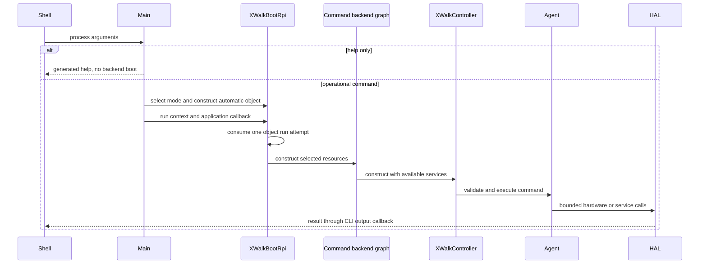
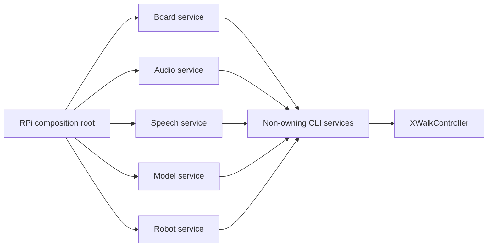

# xWalk CLI architecture and HAL integration plan

**Project:** xWalk Firmware

**Executable:** `xwalk-picarx-control`

**Owning modules:** `xWalk-rpi5-hw/xWalkController/xWalkHandler`, `xWalk-rpi5-hw/xWalkController/xWalkApp`, and
`xWalk-rpi5-hw/xWalkAgent/xWalkPlatform/xWalkBoot`

**Document date:** 2026-08-02

**Status:** Current implementation plus proposed integration plan

## 1. Purpose

This document describes the implemented CLI architecture, its current commands, the Raspberry Pi object graph,
HAL module coverage, modules that are not yet exposed, and a staged plan for safely adding them.

The plan is architectural guidance. Commands marked as proposed do not exist until their code, help, tests,
CMake wiring, deployment configuration, and safe backend composition are implemented.

## 2. Source layout

```text
xWalk-rpi5-hw/xWalkAgent/xWalkPlatform/xWalkBoot/
├── core/include/                       shared boot lifecycle and service types
├── core/src/                           shared one-shot boot lifecycle
├── hardware/include/                   Raspberry Pi boot contract
├── hardware/src/                       Raspberry Pi composition root
├── stub/include/                       device-free host-stub contract
├── stub/src/                           device-free host-stub implementation
├── stub/test/include/                  host-only fixture declarations
└── stub/test/src/                      deterministic host lifecycle coverage
xWalk-rpi5-hw/xWalkAgent/xWalkVoice/xWalkLocalVoiceChatbot/
├── include/                            chatbot contract and application callbacks
├── src/                                foreground loop and response filtering
└── test/src/                           deterministic voice-pipeline coverage
xWalk-rpi5-hw/xWalkAgent/xWalkVoice/xWalkVoiceActiveCar/     sensor, wake-word, speech, response, and action coordination
xWalk-rpi5-hw/xWalkAgent/xWalkVoice/xWalkVoiceActiveCarGpt/  English Buddy language profile
xWalk-rpi5-hw/xWalkAgent/xWalkVoice/xWalkGptCar/             upstream JSON GPT-car profile
xWalk-rpi5-hw/xWalkController/xWalkHandler/
├── include/xController.h         parser and coordinator contract
├── include/xControllerTypes.h    callback and sound-operation types
├── src/xControllerLifecycle.cpp  dependency and callback binding
├── src/common/                                shared command-safety support
├── src/vehicle/                               movement and sensing handlers
├── src/vision/                                camera and visual-control handlers
├── src/voice/                                 speech and language-model handlers
├── src/media/                                 sound and background-music handlers
├── src/connectivity/                          application-control and SPI handlers
├── src/calibration/                           calibration and verification handlers
├── src/platform/                              passive platform handlers
└── test/src/xControllerTest.cpp  deterministic handler coverage
xWalk-rpi5-hw/xWalkController/xWalkApp/
├── CMakeLists.txt                              executable targets and CTest registration
├── activate/include/                          command-activation declarations
├── activate/src/                              validated command routing and usage
├── activate/resources/help.json               generated help source
├── boot/include/                              boot and application-support declarations
├── boot/src/                                  callbacks, boot selection, and runner
├── cli/hardware/src/xControllerMain.cpp       Raspberry Pi entry and boot composition
├── cli/host/src/                              host entry and host-stub lifecycle
├── parse/include/xControllerParsing.h         typed parser declarations
├── parse/src/                                 option, command, request, and output parsing
└── test/src/xControllerAppTest.cpp isolated host-application GoogleTest
xWalk-rpi5-hw/xWalkController/xWalkConfig/
├── picar-x.conf                               manifest and mutable overrides
└── picar-x.d/                                 functional and AI-provider fragments
```

The CLI imports the Agent aggregate. Its Raspberry Pi executable links `xWalkBootRpi`, which privately owns
board control, Linux I2C and GPIO, ALSA, native audio decoding, and command-specific Agent services.

Controller-owned headers and sources use the compact `xController<Component>`
filename convention. Generic shared types are qualified through `ctrl::`;
Agent coordinator types use `agent::`, while hardware-specific contracts stay
qualified through `hal::`. Build and editor metadata must reference the compact
filenames so removed `xAgent_Rpi5CarController<Component>` paths do not survive
in compilation databases.

Both executables use `XWALK_parseControllerApplicationArguments()` from
`parse/src/xControllerApplicationArguments.cpp`. This gives host and Raspberry Pi builds one
validation contract for deployment and resource options. Host main delegates
its complete behavior to `XWALK_runHostControllerApplication()`; Raspberry Pi
main retains only signal installation, resource validation, boot-mode
selection, and hardware composition.

## 3. Request lifecycle



Help is returned before backend boot. It does not open I2C, claim GPIO, start ALSA, move hardware, or contact
an external provider.

## 4. One-shot boot contract

`XWalkBootRpi::run()` accepts a context and synchronous application callback. The object marks itself started
before claiming hardware. A successful, failed, or throwing callback consumes that object's only run attempt.
Backend objects remain local to `run()` and live until the command callback returns. They are destroyed in
reverse order before `run()` returns, and the automatic boot object is destroyed when `main()` exits.

## 5. CLI callback boundary

`XWalkControllerCallbacks` supplies synchronous application operations:

| Callback | Current Raspberry Pi implementation |
| --- | --- |
| Output | Writes one line to standard output |
| Input | Writes a prompt and reads standard input |
| Delay | Calls the shared millisecond sleep facility |
| Continue line tracking | Reads signal-controlled foreground state |
| Sound | Routes through boot-owned Music and the native libsndfile/ALSA backend |

The callback context is non-owning. All callbacks must remain valid for the CLI lifetime.

## 6. Current command surface

| Command | Actions or required values | Current implementation |
| --- | --- | --- |
| `move` | `forward`, `backward` | PiCar-X motor coordination |
| `turn` | `left`, `right` | Steering plus bounded movement sequence |
| `cam` | `pan`, `tilt` | Camera-servo positioning |
| `sensor` | `distance`, `grayscale` | Ultrasonic and grayscale acquisition |
| `spi` | `transfer` plus hexadecimal bytes | SPI-only full-duplex transaction |
| `line-track` | `start`, `stop` | Foreground line-tracking Agent |
| `self-drive` | One preset action | SelfDrive Agent and ALSA music |
| `sound` | `play`, `volume`, `music`, `stop` | Native WAV/MP3 decoding and ALSA playback |
| `voice-chat` | `start`, `stop` | Local voice-chat service boundary |
| `voice-active-car` | `start`, `stop` | Sensor-aware voice-car service boundary |
| `voice-active-car-gpt` | `start`, `stop` | English Buddy voice-car profile |
| `gpt-car` | `start`, `stop` plus source flags | Upstream JSON GPT-car profile |
| `voice-controlled-car` | `start`, `stop` | Wake-word movement-control service boundary |
| `voice-prompt-car` | `start`, `stop` | Spoken movement-demonstration service boundary |
| `calibrate` | No subcommand | Interactive steering, pan, and tilt calibration |

Movement speed is limited to 100 percent. Steering is limited to 30 degrees. Camera pan and tilt use their
documented mechanical command ranges. Movement sequences stop the motors after successful completion.

## 7. Self-drive action names

The CLI publishes shell-friendly names and converts hyphens to the exact Agent action name:

```text
shake-head
nod
wave-hands
resist
act-cute
rub-hands
think
twist-body
celebrate
depressed
forward
backward
honking
start-engine
```

Separate action words remain compatible, such as `self-drive wave hands`. The Agent performs final validation
before hardware changes.

## 8. Raspberry Pi composition

The current operational path performs these steps:

1. Discover the Robot HAT through `XWalkDevice`.
2. Create `XWalkI2cLinux` and the callback-driven `XWalkI2c` front end.
3. Create reset and speaker GPIO objects retained for the boot callback.
4. Create battery ADC A4 and retained `XWalkBoardControl`, then reset the MCU.
5. Keep board control alive so voice playback retains speaker-enable ownership.
6. Create shared PWM timer state and pan, tilt, and steering servos.
7. Create D2 and D3 GPIO objects for ultrasonic acquisition.
8. Create ADC A0, A1, and A2 plus `XWalkGrayscaleModule`.
9. Create `XWalkUltrasonic` and the PiCar-X configuration store.
10. Create the board-specific motor graph.
11. Create `XWalkPicarx` from the complete caller-owned graph.
12. Create a command-specific Agent and backend graph when required.
13. Construct `XWalkController` last and dispatch the command.

### 8.1 Board-specific motor branch

Robot HAT v5 creates four PWM channels: P12, P13, P14, and P15. A legacy board creates P13 and P12 plus D4
and D5 direction GPIO lines.

### 8.2 Line-tracking branch

Only a `line-track` command creates `XWalkLineTracking`. `start` installs SIGINT and SIGTERM handlers and runs
bounded steps in the foreground until cancellation. `stop` performs an immediate stop in the current process.
It does not control a separate CLI process.

### 8.3 Self-drive branch

Only a `self-drive` command creates `XWalkAudioAlsa`, `XWalkMusicAlsa`, native decoding, `XWalkMusic`, and
`XWalkSelfDrive`. A `sound` command creates the same audio graph without SelfDrive. This keeps the mixer and
PCM owner out of unrelated command paths.

### 8.4 Voice branches

Voice commands select dedicated boot modes and publish typed Agent service
boundaries. The direct movement behaviors live in `xWalkVoiceActiveCar`:
`XWalkVoiceControlledCar` recognizes “hey robot”, movement words, and “sleep”;
`XWalkVoicePromptCar` speaks and runs the four-movement demonstration. The
Raspberry Pi composition loads the configured Vosk library and model, captures
microphone PCM through ALSA, and publishes `XWalkSpeechToText`. The prompt path
runs Espeak without a shell, parses its PCM WAV output, plays it through the
shared ALSA owner, and publishes `XWalkTextToSpeech` while Robot HAT speaker
power remains claimed. The application callback constructs the Agent with these
boot-owned HAL services and signal-aware callbacks. Voice chat and voice-active
commands additionally compose Ollama and `XWalkVoiceAssistant`; voice-active
commands add Music, SelfDrive, the status LED, and `XWalkCameraCapture`. The
camera Agent calls the backend-neutral camera HAL, while deployment selects CSI
through `rpicam-still` or USB V4L2 through `ffmpeg`.

## 9. Current HAL coverage

The coverage terms used here are:

- **Command:** directly visible to the CLI user.
- **Internal:** composed only as a dependency of another command.
- **Partial:** some module behavior is exposed, but significant public behavior is not.
- **Missing:** no current CLI composition or user command.

| Module | Coverage | Current use |
| --- | --- | --- |
| `xWalkI2c` | Internal | Bus for PiCar-X hardware |
| `xWalkGpio` | Internal | Reset, speaker, LED, ultrasonic, and legacy motor direction |
| `xWalkSpi` | Command | `spi transfer` through an SPI-only boot graph |
| `xWalkPwm` | Internal | Servos and motors |
| `xWalkAdc` | Internal | Grayscale and temporary battery ADC |
| `xWalkCamera` | Internal | Voice-active still-image input through CSI or USB |
| `xWalkServo` | Partial | Camera, steering, and calibration only |
| `xWalkMotor` | Partial | PiCar-X movement only |
| `xWalkLineTracker` | Partial | Grayscale module only; the tracker class is not composed |
| `xWalkUltrasonic` | Command | `sensor distance` |
| `xWalkConfig` | Partial | PiCar-X calibration store only |
| `xWalkBoardControl` | Partial | Device discovery, MCU reset, and speaker power |
| `xWalkAudio` | Internal | Music, sound, and voice capture/playback |
| `xWalkMusic` | Command | Self-drive actions and `sound` playback or volume |
| `xWalkAdxl345` | Missing | No accelerometer command |
| `xWalkLed` | Internal | Voice-active-car status indication |
| `xWalkBuzzer` | Missing | No buzzer command |
| `xWalkRobot` | Missing | No robot action or servo-frame command |
| `xWalkUserButton` | Missing | No button state or bounded monitor command |
| `xWalkSpeaker` | Missing | Sound commands use Music rather than Speaker |
| `xWalkGPT` | Command | Vosk recognition and Espeak synthesis for voice-car commands |
| `xWalkLanguageModel` | Internal | Configured HTTP model for voice-chat and voice-active commands |
| `xWalkVoiceAssistant` | Command | Complete pipeline for voice-chat and voice-active commands |
| `xWalkTrace` | Missing | No trace configuration or output composition |
| `xWalkUtils` | Missing | No platform-information or utility commands |

`xWalkLibraryCommon` is used throughout but is not itself an operational CLI feature.

## 10. Missing CLI modules

### 10.1 Fully absent from the command graph

The following completed HAL modules have no current CLI command or composition:

- `xWalkAdxl345`;
- `xWalkBuzzer`;
- `xWalkRobot`;
- `xWalkUserButton`;
- `xWalkSpeaker`;
- `xWalkTrace`;
- `xWalkUtils`.

### 10.2 Partially covered modules

- `xWalkBoardControl` lacks battery, firmware, speaker-enable, and speaker-disable commands.
- `xWalkMusic` lacks tone, pause, and resume commands.
- `xWalkAudio` has no explicit user-facing device or mixer selection.
- `xWalkConfig` is limited to the PiCar-X calibration path.
- `xWalkLed` is composed only as voice-active status output and has no direct command.
- `xWalkLanguageModel` is composed through Ollama but has no direct model command.
- `xWalkServo` and `xWalkMotor` are exposed only through PiCar-X operations.
- raw I2C, GPIO, PWM, and ADC diagnostics are intentionally not exposed.

## 11. CLI expansion principles

New integration should preserve these rules:

1. Parse enough of the command before constructing a hardware graph.
2. Compose only the backend and HAL objects required by that command.
3. Keep help and read-only syntax discovery free of hardware and network access.
4. Store optional services as nullable, non-owning dependencies.
5. Return status 3 with a clear unavailable message when a required service is not composed.
6. Keep provider credentials, model endpoints, devices, and pin roles in deployment configuration.
7. Keep `line-track` limited to `start` and `stop`.
8. Make long-running operations foreground, bounded, and cancellable.
9. Validate all coordinated outputs before the first physical mutation.
10. Add host tests before opt-in hardware tests.

## 12. Proposed command organization

The following names are proposals for implementation planning. They are not current commands.

| Proposed group | Proposed actions | HAL modules |
| --- | --- | --- |
| `board` | `info`, `battery`, `firmware`, `speaker-on`, `speaker-off` | BoardControl |
| `accelerometer` | `read` | ADXL345 |
| `led` | `on`, `off`, `rgb`, `blink`, `stop` | LED and RGB LED |
| `buzzer` | `on`, `off`, `tone` | Buzzer |
| `robot` | `position`, `action`, `move`, `stop`, `reset` | Robot |
| `button` | `state`, `monitor` | UserButton |
| `music` | `play`, `pause`, `resume`, `stop`, `volume`, `tone` | Music and Audio |
| `sound` | Existing actions | Speaker, Music, and Audio adapters |
| `speech` | `listen`, `transcribe`, `speak`, `stop` | GPT and Audio |
| `model` | `prompt`, `instructions`, `clear` | LanguageModel and Ollama |
| `voice-assistant` | `run`, `stop` | VoiceAssistant, GPT, model, and audio |
| `platform` | `info`, `ip`, `user`, `executable`, `volume` | Utils |
| `trace` | `level` | Trace |
| `config` | `get`, `set`, `write`, `reload` | Config |

Raw `i2c`, `gpio`, `pwm`, and `adc` mutation commands should not be added to the normal robot CLI. If field
diagnostics require them, place them under a separately built diagnostic executable with explicit allowlists,
pin and channel restrictions, and stronger safety prompts.

## 13. Service injection design

The current CLI has constructor overloads for PiCar-X, line tracking, and self-drive. Continuing with one
constructor per combination will not scale to all HAL modules.

A future implementation should introduce a documented, non-owning service aggregate owned by the application.
For example, it may contain nullable pointers to board, speaker, music, speech, model, voice, robot, button,
utility, and diagnostic coordinators. The aggregate must not allocate or own these services.



This is a proposed reusable convention and must be reviewed against the coding guide before implementation.
Until approved, focused constructor overloads remain the established pattern.

## 14. Command implementation structure

Each command handler has one source file, grouped by its owning functionality:

```text
xWalk-rpi5-hw/xWalkController/xWalkApp/activate/src/                             command activation and routing
xWalk-rpi5-hw/xWalkController/xWalkApp/parse/src/                                typed parsing and output formatting
xWalk-rpi5-hw/xWalkController/xWalkApp/boot/src/                                 boot selection and service composition
xWalk-rpi5-hw/xWalkController/xWalkHandler/src/common/                                       shared safety support
xWalk-rpi5-hw/xWalkController/xWalkHandler/src/vehicle/                                      movement and sensing
xWalk-rpi5-hw/xWalkController/xWalkHandler/src/vision/                                       camera and vision
xWalk-rpi5-hw/xWalkController/xWalkHandler/src/voice/                                        voice and AI
xWalk-rpi5-hw/xWalkController/xWalkHandler/src/media/                                        audio operations
xWalk-rpi5-hw/xWalkController/xWalkHandler/src/connectivity/                                 external control
xWalk-rpi5-hw/xWalkController/xWalkHandler/src/calibration/                                  calibration operations
xWalk-rpi5-hw/xWalkController/xWalkHandler/src/platform/                                     platform diagnostics
```

Every `XWALK_handler...` method remains isolated in its own translation unit.
`XWALK_runPicarxControllerCommand()` is a separate application free function
with friend access to route commands without publishing protected handlers.
Each file retains complete function documentation and is listed explicitly in
the controller CMake target.

## 15. Staged implementation plan

### Completed foundation

- The stale aggregate dependency has been removed, so the HAL source tree and CMake graph agree.
- `sound` uses boot-owned native decoding, `XWalkMusic`, shared ALSA output, and retained speaker power.
- Voice chat and voice-active commands compose Vosk, Espeak, ALSA, the configured model backend, and
  `XWalkVoiceAssistant`.
- Host tests remain the default verification path; Raspberry Pi tests are discovery-only without approval.

### Phase 2: add read-only board and sensor commands

Add the lowest-risk commands first:

- `board info` from `XWalkDevice`;
- `board battery` from `XWalkBoardControl`;
- `board firmware` from `XWalkFirmwareInfo`;
- `accelerometer read` from `XWalkAdxl345`;
- `button state` from a caller-selected input without starting its worker;
- read-only platform information from `XWalkUtilsLinux`.

Avoid resetting the MCU for commands that only need discovery or direct sensor access. Split the current eager
PiCar-X graph so a read-only board command does not create motors, servos, or ultrasonic GPIO lines.

Completion gate: help remains device-free and each command has deterministic host values and failure coverage.

### Phase 3: add bounded actuator commands

Add LED and buzzer before multi-servo robot actions:

1. Compose exact GPIO or PWM dependencies only after action validation.
2. Require bounded duration for blink and tone commands unless an explicit `off` command is guaranteed.
3. Apply inactive output during construction and normal command completion.
4. Add robot commands only after servo channel configuration and safe poses are deployment-controlled.
5. Make `robot stop` and `robot reset` safe, idempotent operations.

Do not expose unrestricted pin or PWM channel selection through user input.

Completion gate: host tests prove validation precedes mutation and every timed action reaches an inactive
state.

### Phase 4: expose configuration and diagnostics

Add narrowly scoped configuration keys rather than arbitrary filesystem paths. Proposed behavior:

- `config get` reads allowlisted deployment or calibration fields;
- `config set` validates a typed value in memory;
- `config write` performs explicit persistence;
- `trace level` changes one caller-owned trace object;
- `platform volume` uses the approved mixer backend.

Do not add a general shell-command action even though `XWalkUtilsLinux` supports process execution. The normal
robot CLI must not become an arbitrary command launcher.

Completion gate: paths, keys, values, and process behavior are allowlisted and covered by host tests.

### Phase 5: add speech recognition and synthesis

Add command-local speech graphs:

- `speech listen` creates ALSA capture and one configured recognizer;
- `speech transcribe` uses a validated bounded input path and the recognizer;
- `speech speak` creates board speaker power, one synthesizer, and ALSA playback;
- `speech stop` cancels recognition in the current foreground process.

Device names, recognizer, synthesizer, language, credentials, timeouts, and maximum PCM sizes are deployment
configuration. Do not print microphone samples, credentials, or synthesized PCM.

Completion gate: fake-provider host tests pass and target tests require explicit device and privacy approval.

### Phase 6: add language-model commands

Compose `XWalkLanguageModelOllama` only for a `model` or `voice-assistant` command. Require an explicit
endpoint,
model, timeout, maximum history, and prompt-size limit.

`model prompt` should perform one bounded synchronous request. Instructions and history operations should use
the same process-local model owner. A one-shot executable cannot preserve history between separate invocations
unless a deployment-approved persistent history service is added.

Completion gate: host tests use fake transport, no test contacts a network, and logs omit prompt content by
default.

### Phase 7: compose the voice assistant

For `voice-assistant run`, create dependencies in this order:

1. board discovery, speaker GPIO, ADC, and board control;
2. shared ALSA owner;
3. ALSA capture and recognizer, then `XWalkSpeechToText`;
4. Ollama backend, then `XWalkLanguageModel`;
5. synthesizer and ALSA playback, then `XWalkTextToSpeech`;
6. `XWalkVoiceAssistant`;
7. CLI command adapter.

Run one round by default. Any repeated mode must be foreground, signal-cancellable, and bounded between
rounds.
Wake-word detection is not part of the current HAL and requires a separately reviewed backend.

Completion gate: an end-to-end host test covers silence, recognized input, model response, synthesis,
playback, stop, and all unavailable-provider paths.

### Phase 8: add bounded event monitoring

`button monitor` may start the `XWalkUserButton` worker only after callbacks and signal cancellation are
ready.
Print event names, not unbounded diagnostics. Stop and join the worker before GPIO destruction.

Do not use button callbacks to invoke blocking speech, model, filesystem, or playback operations directly.
Queue a bounded application event instead.

Completion gate: host tests cover Ctrl+C cancellation, callback lifetime, long press, and clean joining.

## 16. CMake integration plan

For each command family:

1. Keep the neutral CLI library free of Linux headers.
2. Link core service libraries only when their types enter the CLI contract.
3. Enable Linux or provider targets only for the Raspberry Pi executable.
4. Propagate required backend options before the corresponding subdirectory is configured.
5. Link optional platform libraries to backend targets, not to hardware-independent modules.
6. Add host tests using fake callbacks and target tests under the `hardware` label.

Expected Raspberry Pi dependencies eventually include `xWalkSpeakerAlsa`, `xWalkSpeechToTextAlsa`,
`xWalkTextToSpeechAlsa`, `xWalkLanguageModelOllama`, `xWalkUtilsLinux`, and their neutral consumers.

## 17. Configuration architecture

Do not hard-code deployment-specific values in the parser. Define one application configuration loaded before
backend construction with fields for:

- I2C and GPIO device paths;
- board override and allowed digital or PWM roles;
- ALSA capture, playback, mixer, and element names;
- audio volume and bounded playback defaults;
- recognizer and synthesizer selection;
- microphone rate, channels, format, and timeout;
- Ollama endpoint, model, timeout, history, and request limits;
- credential file locations without credential contents;
- robot servo channels, safe ranges, and stored calibration paths.

Validate the complete selected command configuration before opening its first resource.

## 18. Status and error behavior

Retain these process outcomes:

| Status | Meaning |
| ---: | --- |
| 0 | Command completed successfully |
| 3 | Command exists but its selected service or backend is unavailable |
| Exception-driven failure | Invalid syntax, range, lifecycle, backend, or provider failure |

Future application entry-point policy may translate project exceptions to stable nonzero process codes, but it
must not add broad catch-and-ignore behavior or continue after partial hardware initialization.

## 19. Testing strategy

Every new command requires:

- parser tests for valid syntax, missing arguments, unknown actions, and option ranges;
- dispatch tests proving the correct service method and callback ordering;
- unavailable-service tests returning status 3 without mutation;
- lifecycle tests proving workers and resources stop in reverse order;
- host backend tests using injected operations;
- RPi compile and hardware-test discovery without execution;
- help and README synchronization.

Physical hardware tests remain opt-in. Listing is the normal verification action:

```bash
ctest --test-dir <rpi-build-directory> -N -L hardware
```

## 20. Recommended delivery order

| Priority | Deliverable | Reason |
| ---: | --- | --- |
| 1 | Board, firmware, ADXL345, and platform reads | Mostly read-only and bounded |
| 2 | LED and buzzer commands | Small, independently stoppable output graphs |
| 3 | Configuration and trace controls | Supports later deployment diagnostics |
| 4 | Robot and button commands | Adds multi-servo and worker lifecycle complexity |
| 5 | Direct speech commands | Reuses the composed devices and providers |
| 6 | Direct language-model command | Requires endpoint and network policy |
| 7 | Additional voice profiles | Reuses the complete speech, model, and audio graph |

## 21. Completion definition

CLI HAL coverage is complete when:

- every intended user-facing HAL capability has a documented command or an explicit safety exclusion;
- every command composes only its required backend graph;
- help remains free of hardware, audio, microphone, and network side effects;
- all deterministic host tests pass;
- the Raspberry Pi build compiles all selected backends;
- hardware tests are listed and documented without being executed automatically;
- deployment configuration and resource ownership are documented.
