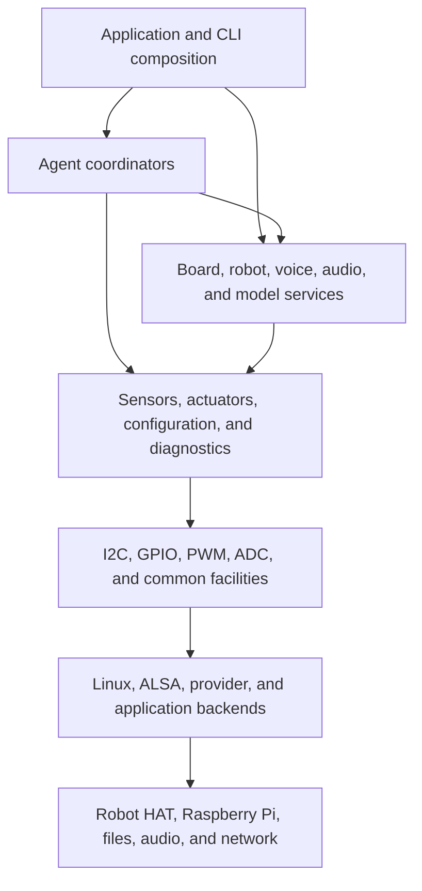
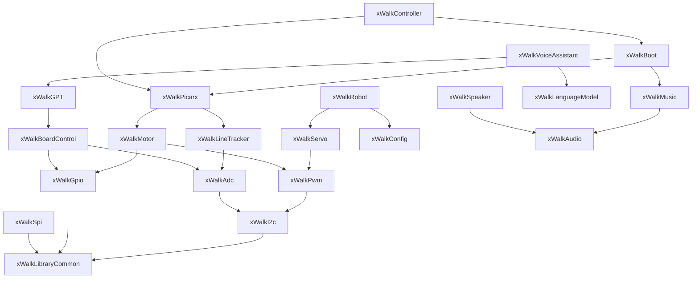

# xWalk high-level architecture

**Project:** xWalk Firmware

**Language:** C++17

**Architecture style:** Layered, dependency-injected, MISRA C++-oriented

**Document date:** 2026-08-01

**Status:** Current source architecture

## 1. Purpose

This document describes the high-level structure of the complete xWalk workspace. It explains the major
layers, dependency direction, module responsibilities, ownership rules, and build boundaries without
duplicating register-level or operating-system backend details.

Use the companion documents for implementation detail:

- [HAL Hardware Architecture](HAL%20Hardware%20Architecture.md) describes physical resources, Linux and
  provider backends, device ownership, board revisions, protocols, and backend verification.
- [CLI Architecture](CLI%20Architecture.md) describes command dispatch, boot composition, current HAL
  coverage, missing CLI integrations, and the staged implementation plan.

Public headers remain authoritative for exact API contracts. Module READMEs remain authoritative for focused
build and test commands.

## 2. Architectural goals

The implementation is designed to provide:

- deterministic hardware-independent behavior that can be tested on a host;
- explicit ownership of Linux handles, hardware lines, audio devices, and workers;
- dependency injection between hardware front ends, feature modules, and applications;
- bounded I/O, worker, queue, audio, recognition, and model operations;
- one-way dependencies from application coordination toward lower-level services;
- separate production, host-test, and Raspberry Pi hardware-build configurations;
- safe application composition without global hardware objects;
- reusable HAL modules that do not depend on the CLI or Agent layer.

## 3. Repository structure

```text
MyPiCarX/
├── xWalk-rpi5-hw/xWalkLibrary/                reviewed project-managed dependencies
│   └── common/               common interface target, headers, and portable assets
├── xWalk-rpi5-hw/xWalkAudioResources/         packaged sound effects, music, and provenance
├── xWalk-rpi5-hw/xWalkHal/                     hardware abstraction and provider-neutral features
│   ├── xWalkI2c/                 hardware front end plus Linux backend
│   ├── xWalkGpio/                hardware front end plus Linux backend
│   ├── xWalkSpi/                 bounded SPI front end plus Linux backend
│   ├── xWalkAudio/               shared ALSA ownership
│   ├── xWalk*/                   independently configurable HAL modules
│   └── CMakeLists.txt            aggregate HAL composition
├── xWalk-rpi5-hw/xWalkAgent/                   application-level robot coordinators
│   ├── xWalkVehicle/             movement, sensing, and autonomous behavior
│   ├── xWalkCalibration/         sensor, servo, and motor calibration
│   ├── xWalkVision/              camera, detection, tracking, and video
│   ├── xWalkMedia/               sound and background-music coordination
│   ├── xWalkVoice/               speech and conversational AI
│   ├── xWalkConnectivity/        external control and SPI transactions
│   └── xWalkPlatform/            boot and platform composition
├── xWalk-rpi5-hw/xWalkController/              standalone command-line aggregate
│   ├── xWalkHandler/             parser and command-handler implementation
│   ├── xWalkApp/                 executable targets, entry points, generated help, and GoogleTest
│   ├── xWalkConfig/              layered runtime and provider configuration
│   └── xWalkTest/                centralized CLI and sequence verification
├── xWalk-rpi5-tool/                    maintenance, deployment, licence, and verification tools
├── Doc/note/                     cross-module C++ documentation index
├── devloper-note/                            architecture and implementation notes
```

The aggregate HAL CMake file includes every HAL module present in the source tree and does not reference
missing module directories.

## 4. Layer model



Dependencies point downward. A HAL module never includes or links the Agent or CLI layer. Hardware-independent
front ends do not construct target-specific backends.

## 5. Foundation modules

| Module | High-level responsibility |
| --- | --- |
| `xWalkLibraryCommon` | Project types, constants, errors, math, files, and common functions |
| `xWalkConfig` | Section-aware and flat key-value configuration persistence |
| `xWalkTrace` | Filtered diagnostics through a caller-provided output callback |
| `xWalkUtils` | Platform utilities, lazy reads, and standard-error restoration |

`xWalkLibraryCommon` is the shared dependency beneath the workspace. Its interface target exports the public
headers stored in `xWalk-rpi5-hw/xWalkLibrary/common`. Production modules use its fixed-width and standard-library aliases
rather than introducing unrelated type spellings.

The common header exports the same generic type vocabulary through separate
layer namespaces. HAL code uses `hal::`, Agent code uses `agent::`, and
Controller code uses `ctrl::`. Hardware-specific classes and callback
contracts remain in `hal`; higher layers do not qualify generic types through
the HAL namespace.

`xWalkAudioResources` combines repository-owned audio assets under `sounds/`
and `music/`. The `xWalk-rpi5-hw/xWalkHal/interface/xWalkAudio` directory remains a separate ALSA
implementation module and does not own packaged media files.

## 6. Primitive hardware modules

| Module | High-level responsibility |
| --- | --- |
| `xWalkI2c` | Callback-driven bus transactions and optional Linux bus ownership |
| `xWalkGpio` | Digital pin semantics, events, and optional Linux line ownership |
| `xWalkSpi` | Bounded full-duplex transactions and optional Linux device ownership |
| `xWalkPwm` | Robot HAT MCU PWM channels and caller-owned timer state |
| `xWalkAdc` | Robot HAT MCU ADC acquisition and voltage conversion |

I2C and GPIO define the main operating-system boundary. PWM and ADC are protocol clients layered on I2C.

## 7. Sensor and actuator modules

| Module | High-level responsibility |
| --- | --- |
| `xWalkServo` | Angle and pulse-width conversion over PWM |
| `xWalkMotor` | Single-motor modes and validated paired-motor control |
| `xWalkLed` | Digital LED and three-channel PWM RGB LED control |
| `xWalkBuzzer` | Active GPIO and passive PWM buzzer control |
| `xWalkUltrasonic` | Bounded trigger and echo distance measurement |
| `xWalkAdxl345` | I2C acceleration measurement |
| `xWalkLineTracker` | Grayscale calibration, line status, and cliff detection |
| `xWalkUserButton` | Active-low events, press timing, and monitor lifecycle |

These modules receive caller-created I2C, GPIO, PWM, or ADC objects by reference. They neither open Linux
devices nor claim unrelated hardware.

## 8. Board and robot modules

| Module | High-level responsibility |
| --- | --- |
| `xWalkBoardControl` | Board discovery, MCU reset, battery, speaker power, and firmware data |
| `xWalkRobot` | Coordinated multi-servo positions, actions, and stored calibration |

Board discovery owns only its discovered information and filesystem path. Board control receives GPIO and ADC
objects from the composition root. Robot receives configuration and servo dependencies from its caller.

## 9. Audio, speech, and model modules

| Module | High-level responsibility |
| --- | --- |
| `xWalkAudio` | Shared ALSA PCM and mixer ownership |
| `xWalkMusic` | Music conversion, tones, sound effects, and injected playback |
| `xWalkSpeaker` | Bounded asynchronous decoded-file playback |
| `xWalkGPT` | Speech coordination, ALSA adapters, and offline Vosk/Espeak providers |
| `xWalkLanguageModel` | Provider-neutral conversation and prompting |
| `xWalkVoiceAssistant` | One synchronous recognition, model, and speech round |
| `xWalkCamera` | Bounded still-image capture with Linux CSI and USB providers |

The coordinator classes do not own credentials, microphones, model processes,
network transports, or audio devices. Linux provider classes own only their
explicit Vosk library/model or bounded Espeak process state. Concrete target
graphs are selected and created by `xWalkBootRpi`.

## 10. Agent and application modules

| Module | High-level responsibility |
| --- | --- |
| `xWalkPicarx` | PiCar-X movement, sensing, calibration, and safe stop coordination |
| `xWalkLineTracking` | Foreground bounded line-following decisions and recovery |
| `xWalkCameraCapture` | Camera HAL adaptation for voice-active image callbacks |
| `xWalkSelfDrive` | Named gestures, short movement, sounds, and action queue behavior |
| `xWalkVoiceActiveCar` | Sensor-aware, wake-word, and spoken movement coordination |
| `xWalkBoot` | Device-free boot stub and command-specific Raspberry Pi composition |
| `xWalkController` | Parsing and hardware-independent command coordination |

Agents coordinate caller-owned HAL objects. They do not duplicate Linux backends or own injected project
dependencies.

## 11. Dependency direction

Representative dependencies are:



Some arrows represent application composition through adapter targets rather than a direct core-library link.
Exact target dependencies are defined by the owning CMake files.

## 12. Ownership and lifetime

The application entry point owns the object graph. Normal construction order is:

1. Create platform and provider backend contexts.
2. Create I2C, GPIO, audio, or network-facing backend owners.
3. Create hardware-independent front ends and shared timer state.
4. Create sensors, actuators, board services, and configuration objects.
5. Create Agent coordinators or voice pipeline coordinators.
6. Create the CLI or application controller last.
7. Stop workers and active outputs before dependencies leave scope.

Destruction occurs in reverse order. Stored project dependency pointers are non-owning. Any retained callback
context must outlive the object and every callback invocation that uses it.

## 13. Concurrency and bounded work

Thread safety is explicit rather than assumed. External serialization is required unless a class documents its
own mutex or worker protection. Important shared state includes:

- I2C logical transactions and device selection;
- PWM timer state shared by related channels;
- GPIO event and user-button workers;
- speaker playback tasks and shared ALSA streams;
- speech, model, and voice-assistant callback contexts;
- configuration files shared by multiple objects or processes.

Workers must stop before their callback contexts or hardware dependencies are destroyed. Worker callbacks and
destructor cleanup must not throw.

## 14. Error model

Inputs are validated before hardware mutation whenever possible.

| Error category | Typical cause |
| --- | --- |
| Invalid argument | Null callback, malformed name, empty required text, or non-finite value |
| Out of range | Unsupported channel, percentage, duration, or enumerator |
| Logic error | Lifecycle conflict, duplicate boot, or shared timer conflict |
| Runtime error | Backend, protocol, hardware, provider, or persistence failure |
| Filesystem error | Configuration or device-tree operation failure |

Normal synchronous callback failures propagate through the established project error mechanism. Destructors
must not propagate exceptions.

## 15. Build architecture

Each module has its own CMake entry point and disabled-by-default host or hardware options. The workspace root
owns aggregate HAL composition; `xWalkHal` intentionally has no aggregate CMake file:

- `BUILD_TESTING=ON` with `XWALK_BUILD_RPI=OFF` selects deterministic host tests.
- `XWALK_BUILD_RPI=ON` selects Linux backends and hardware-labelled targets.
- `BUILD_TESTING=OFF` with `XWALK_BUILD_RPI=OFF` builds production libraries only.

The aggregate HAL and Agent builds provide the complete source-tree composition for their respective layers.

Host tests may execute automatically. Raspberry Pi tests must only be listed during ordinary verification:

```bash
ctest --test-dir <rpi-build-directory> -N -L hardware
```

## 16. Safety boundaries

- Help and discovery must not claim GPIO lines, start audio, contact a model, or move an actuator.
- Motor and coordinated servo operations validate complete requests before changing outputs.
- Hardware tests are opt-in and require the correct Raspberry Pi, Robot HAT, wiring, and safe setup.
- Device paths, ALSA names, model endpoints, and pin assignments are deployment configuration.
- Interrupt and worker callbacks must remain bounded and must not perform slow network or storage work.
- Battery measurement is diagnostic and is not the only electrical protection layer.

## 17. Extension rules

When extending the architecture:

1. Add one focused public class per header.
2. Keep target ownership in a backend and neutral behavior in the core module.
3. Receive project-class dependencies by reference and document retained pointer lifetimes.
4. Add deterministic host seams before adding physical tests.
5. Keep platform libraries private to backend targets.
6. Compose only the resources needed by the selected application command.
7. Update module READMEs and the relevant architecture document.
8. Compile and list hardware tests without running them unless physical execution is explicitly approved.

## 18. Authoritative references

| Subject | Reference |
| --- | --- |
| Coding rules | `.agents/gudlines/CODING_GUIDELINES.md` |
| Documentation rules | `.agents/gudlines/DOCUMENTATION_GUIDELINES.md` |
| C++ documentation index | `devloper-note/xwalk-rpi5-note/index.md` |
| Module API contracts | `xWalk-rpi5-hw/xWalkHal/xWalk<Module>/include` |
| Module behavior and tests | `xWalk-rpi5-hw/xWalkHal/xWalk<Module>/README.md` |
| Hardware and backends | `devloper-note/xwalk-rpi5-note/Doc/note/HAL Hardware Architecture.md` |
| CLI composition and plan | `devloper-note/xwalk-rpi5-note/Doc/note/CLI Architecture.md` |
