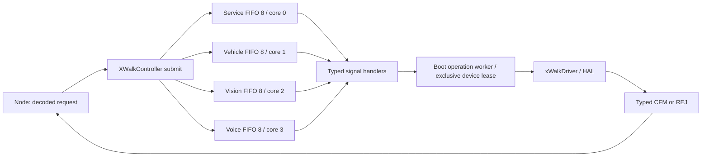

<!-- xwalk-page-header:start -->

[xWalk documentation](../../../index.md) / [2. xWalk hardware](../../index.md) / xWalkController

**2. xWalk hardware &middot; Module 03**

<!-- xwalk-page-header:end -->

# xWalkController

`xWalkController` routes decoded xWalk request structures into four functional Linux worker threads, each with
an eight-entry FIFO pinned to a distinct allowed CPU. The `xWalkControllerBoot` library extends the Controller
with the selected HOST or RPI5 HAL/Driver dependency graph, and the `xwalk-ctrl` terminal verifies and runs it
without MQTT. The Controller library is transport-independent: Node owns the GPB/MQTT adapter, production handlers
forward to the Boot operation runtime, and accepting a request means queued, not completed.

## 1. Overview

| Logical core | Derived class | Function | FIFO capacity |
| --- | --- | --- | --- |
| 0 | `XWalkServiceCore` | service | 8 waiting requests |
| 1 | `XWalkVehicleCore` | vehicle | 8 waiting requests |
| 2 | `XWalkVisionCore` | vision | 8 waiting requests |
| 3 | `XWalkVoiceCore` | voice | 8 waiting requests |

All four classes derive from `XWalkCore`, which owns the worker, FIFO, synchronization and shutdown logic.
`XWalkController` owns the four derived objects and selects their owner using the generated request signal. The
group assignments match the existing Node service, vehicle, vision and voice dispatchers.



The module provides three layers:

| Layer | Target | Responsibility |
| --- | --- | --- |
| Scheduling | `xWalkController` | Validation, deep copy, four functional FIFOs, typed REQ/CFM/REJ handlers |
| Composition | `xWalkControllerBoot` | `XWalkBoot`, module graph, operation runtime and platform providers |
| Terminal | `xwalk-ctrl` | Bounded routing checks, JSON sample input and the standalone `run` runtime |

`XWalkBoot` derives from `XWalkController`. The process composition (Node or standalone `xwalk-ctrl run`) owns
the Boot instance; Node continues to own its own Boot instance when using the MQTT application. Boot behavior
is described in [xWalkBoot](xWalkBoot/xWalkBoot.md); the terminal is described in
[xWalkStandAlone](xWalkStandAlone/xWalkStandAlone.md).

## 2. Source location

`xWalk-rpi5-hw/xWalkController` — source directory

## 3. Directory layout

```text
xWalkController/
├── CMakeLists.txt          # xWalkController library, host tests, Boot/StandAlone subdirectories
├── CMakePresets.json       # module, host, rpi5 and rpi5-cross presets
├── auto-gen/
│   ├── include/            # Tracked C++ Protobuf bindings generated from xWalk-rpi5-iw
│   └── src/
├── xWalkInit/
│   ├── include/            # Classes, callbacks, FIFO, message, registry and lifecycle contracts
│   └── src/                # Constructors, destructors, shared logic, view copying and initialization
├── xWalkRequest/
│   ├── include/            # Generated request type aliases and request registry
│   └── src/                # Request copying, signal dispatch, typed request handlers and registries
├── xWalkCfm/
│   ├── include/            # Generated CFM type aliases and CFM registry
│   └── src/                # Typed CFM methods on the four functional classes
├── xWalkReject/
│   ├── include/            # Generated REJ type aliases and REJ registry
│   └── src/                # Typed REJ methods on the four functional classes
├── xWalkBoot/              # Boot composition library (child module)
├── xWalkStandAlone/        # xwalk-ctrl terminal, module-build stubs and JSON samples (child module)
├── xWalkConfig/
│   ├── picar-x.conf        # Tracked runtime configuration entry point
│   ├── picar-x.d/          # hardware, vehicle, vision, voice, connectivity, resources and ai/ fragments
│   ├── ctrl.json, rpi.json # Trace presets
│   ├── trace-all-*.json, xwalk-traces.json
│   ├── xwalk-agent-hardware-v4.conf.in  # Robot HAT v4 hardware-test configuration template
│   └── xControllerConfiguration.cmake   # Profile, RPi defaults and runtime-file selection
└── test/
    ├── include/            # <Component>TestSupport.h headers for host tests
    ├── src/                # Host test executables and support implementations
    ├── hardware/           # Opt-in remote core-matrix hardware test (Python)
    └── configuration-cmake-test.cmake
```

The Service, Vehicle, Vision and Voice classes declare all their methods in `xWalkInit/include`. No additional
functional classes are introduced. CMake exports every group's include path, so callers include
`xControllerVehicleCore.h`, for example, without directory prefixes.

Request ownership and copy implementations are in `xWalkRequest/src/xControllerRequestMessage.cpp`.
`xWalkInit/src/xControllerMessage.cpp` retains only shared string/binary-view and client-address copying; the
class declarations and constructors stay in `xWalkInit/include/xControllerMessage.h`.

Registry implementations follow their message families: `xControllerRequestRegistry.cpp` owns request core/size
lookups, `xControllerCfmRegistry.cpp` maps REQ to CFM, and `xControllerRejectRegistry.cpp` maps REQ to REJ. Each
is split into Service, Vehicle, Vision and Voice registry sources in its module. Shared declarations remain in
`xWalkInit/include/xControllerRegistry.h`; the shared entry points delegate to the functional lookups and return
zero (or the unknown-signal sentinel) for unknown request signals.

## 4. Child modules

- [xWalkBoot](xWalkBoot/xWalkBoot.md) — `XWalkBoot` composition, HOST/RPI5 providers, operation runtime,
  cancellation, safety workers and runtime configuration.
- [xWalkStandAlone](xWalkStandAlone/xWalkStandAlone.md) — `xwalk-ctrl` terminal, module-build handler stubs,
  JSON help and 114 request/CFM/REJ samples.

## 5. Public interface

Include `xController.h` and link
`xWalkController`. Production composition includes `xControllerBoot.h` and links `xWalkControllerBoot` (see
[xWalkBoot](xWalkBoot/xWalkBoot.md)).

### Request submission

```cpp
xwalk::controller::XWalkController controller;
if (controller.start())
{
    xwalk::controller::MoveReq request{};
    request.has_request = true;
    request.request.has_speed_percent = true;
    request.request.speed_percent = 25.0;
    const bool accepted = controller.submit(XWALK_CNTRL_MOVE_REQ, &request, sizeof(request));
    // accepted means queued; Boot reports operation completion separately through Node.
    static_cast<void>(accepted);
    static_cast<void>(controller.stop());
}
```

The entry point accepts a signal, `const void*`, and exact structure byte size. It consumes the generated
structures from `xWalkLibrary/auto-gen`; the Controller library has no Node or Protobuf runtime dependency.
Encoded GPB bytes must first be decoded by Node into the matching structure.

This is an in-process ABI: Node and Controller must use the same generated structure definitions. Raw pointers and
`sizeof` values are not an IPC or network representation; a separate-process adapter would need serialization.

The signal and `sizeof` must identify the actual C++ object supplied. Size checks cannot detect two different types
with identical sizes or verify an arbitrary pointer's readability. The caller must supply a valid object and
readable present views for the duration of `submit`.

On success, the structure and every present nested string/binary view are copied into queue-owned memory. The
caller may immediately change or release its input. Embedded zero bytes are preserved. One request supports at most
65,536 combined view bytes (matching the current Node payload bound); invalid or oversized views are rejected
without enqueueing. Absent nested fields are cleared. The owned message does not move, so its internal pointers
remain valid through dispatch.

The signal is checked at enqueue and selects the exact typed handler after FIFO pop. All 38 current request signals
are supported. Unknown signals, wrong sizes, null input, unavailable workers and allocation failures return false
and report a synchronous rejection.

### Typed response handlers

Each request type has matching public `handle<Type>Cfm` and `handle<Type>Rej` methods. All 38 production request
handlers call `XWalkCoreCallbacks::operation`; all 76 typed CFM/REJ handlers call `XWalkCoreCallbacks::response`,
forward the borrowed response to Node and preserve its delivery result. Without that callback, the diagnostic
`CTRL.201` reports an unavailable adapter and the method returns `false`. Automatic diagnostic GPB rejections
still use Node's `XWalkControllerResponse`. Callbacks borrow payloads only until return. A response handler
returns `true` only when Node reports transport delivery. The outer client address takes precedence over a
present nested request address.

### C-style send wrappers

`xController.h` provides three wrappers with the same arguments: non-null Controller pointer, generated signal,
borrowed typed payload pointer, and exact structure byte size. Arguments are evaluated once.

```cpp
const boolean queued = CXX_xWalkSendRequest_LPP(&controller, XWALK_CNTRL_MOVE_REQ, &request, sizeof(request));
const boolean confirmed = CXX_xWalkSendCfm_LPP(
    &controller, XWALK_CNTRL_MOVE_CFM, &confirmation, sizeof(confirmation));
const boolean rejected = CXX_xWalkSendReject_LPP(&controller, XWALK_CNTRL_MOVE_REJ, &rejection, sizeof(rejection));
```

Requests are deep-copied into the functional FIFO. Confirmation/rejection wrappers validate the signal and size
before calling the typed response handler synchronously; they return the Node adapter delivery result, or false
when no adapter is installed. They do not retain payload pointers or claim delivery. Invalid input returns false
and emits the central warning.

### Message access helpers

Helpers in
`xControllerMessageAccess.h`
operate on
`XWalkRequestView`. Include `xController.h` for both the functions and wrappers:

```cpp
XWalkRequestView message{};
const boolean signalSet = CXX_xWalkSetSignal_LPP(&message, XWALK_CNTRL_MOVE_REQ);
const boolean payloadSet = CXX_xWalkSetPayload_LPP(&message, &request, sizeof(request));
const uint32 signal = CXX_xWalkGetSignal_LPP(&message);
const void* payload = CXX_xWalkGetPayload_LPP(&message);
const size length = CXX_xWalkGetPayloadSize_LPP(&message);
const boolean copied = CXX_xWalkMemCopy_LPP(destination, source, length);
```

Setting a payload borrows its pointer and updates its length together; it does not allocate or deep-copy. Invalid
setters leave the view unchanged. Null getters return zero/null. The memory copy uses one shared byte count; both
buffers must provide at least that many accessible bytes. It rejects null nonempty ranges and overlap without
modifying the destination. It copies raw bytes only; nested request views are still deep-copied by the request
send interface.

### Overflow and rejection

Each FIFO holds eight waiting requests, in addition to at most one active request. The next valid incoming request
to a full FIFO is rejected; it does not replace an older entry. Its `XWalkRequestRejection` contains the original
request, matching generated REJ signal, logical core, reason and diagnostic. A configured rejection callback runs
first, followed by central Controller error/assertion traces and `abort()`. This terminates the whole process,
including Release builds with `NDEBUG`; it is intentionally not a graceful drain.

Node's `XWalkControllerResponse` supplies the diagnostic callback and encodes the matching IW `*Rej` message for
all 38 known request structures. It preserves the outer client address, mailbox, local index and module type; a
present nested request address is the fallback. The response topic is
`xwalk/xwalk-pi5-controller/response/<REJ signal>`, using QoS 1 without retention.

Lifecycle warnings/errors and inputs with no safely readable typed structure use the existing `TraceRej` schema on
`xwalk/xwalk-pi5-controller/status`. These have no invented client identity. The Node queue runtime subscribes to
this status topic and logs decoded diagnostics alongside ordinary responses.

The central trace module supplies thread-local scoped forwarding outside its output mutex. Nested scopes restore
the enclosing observer; publication-failure traces remain local to prevent recursive rejection loops. The original
terminal/file trace still appears. `reason` and `error_signal` use the stable IW error-selector number where those
fields exist. Lifecycle REJ schemas retain their existing `code` and bounded detail fields.

The send callback completes its QoS 1 publish attempt before fatal overflow aborts. A broker acknowledgment is not
proof that the remote application processed the rejection. Disconnected transport or encoding failure is logged
locally; delivery cannot be guaranteed when the broker is unavailable. No failed send is retried recursively.
Standalone callers must supply `XWalkCoreCallbacks::diagnostic` to forward diagnostics; the Node runtime installs
it automatically and keeps MQTT alive while Controller queues drain.

### Concurrency and lifetime

`start()` requires at least four CPUs in the process affinity mask and assigns the first four allowed CPU IDs to
logical cores 0–3. On a machine whose allowed IDs are 0–3 those IDs are used directly. Restricted host CPU sets may
map to other IDs; `assignedCpu(core)` reports the mapping. These are Linux logical CPUs, not a promise of exclusive
physical cores. Startup fails cleanly if four CPUs cannot be used.

Multiple producers may submit concurrently. One consumer processes each FIFO in order; different functional workers
run concurrently. Typed production handlers invoke the operation adapter. The scheduler invokes the optional
request callback once after each handler returns, outside the FIFO mutex; handlers do not call an observer helper.
Optional callbacks and their context are non-owning and must remain valid until `stop()` joins every worker.
Synchronize shared callback state. Callbacks must not throw, block indefinitely, or invoke Controller lifecycle
operations.

Use one owner thread for `start`, `stop` and destruction. `stop()` rejects new work, drains already accepted
requests and joins all four workers. Destructors perform the same cleanup without throwing. A stopped Controller
can restart. As with any synchronous callback, shutdown cannot complete until active callbacks return.
`XWalkController` has a virtual destructor and virtual `start()`/`stop()`, so lifecycle calls through a base
pointer retain Boot shutdown.

Standalone Controller callers must supply an operation adapter to execute work; the optional request observer is
a separate notification after dispatch. Boot serializes shared device access through its operation worker; the
four queues remain independent and responsive to cancellation requests while a session is active.

### Controller traces

All diagnostics use the `xWalk-rpi5-trace` module and its `XWALK_CTRL_*` macros. Central trace configuration
controls output and informational priorities; Controller adds no logger or enable flag.

| Trace | Meaning |
| --- | --- |
| `CTRL.090` | Worker started with logical core and assigned CPU |
| `CTRL.091` | Worker stopped after draining its FIFO |
| `CTRL.092` | Request scheduled, with signal and logical core |
| `CTRL.093` | All four functional workers ready |
| `CTRL.094` | Request queued, with signal, core, structure size and enqueue-time occupancy |
| `CTRL.101`–`CTRL.138` | Typed request handler payload, formatted as JSON at priority 3 |
| `CTRL.201` | No Node response adapter is installed; response remains unsent |

Request-handler JSON starts on the next line with indentation; absent fields are `null`, binary values are
hexadecimal strings, and oversized records produce a bounded JSON error. Invalid requests and lifecycle misuse
produce selector-tagged warnings. Startup, resource and shutdown failures produce errors. Overflow logs the
incoming signal and matching rejection signal before the assertion and process abort. Error selectors preserve
the no-throw API. Scheduling traces contain metadata, not request payloads. Concurrent workers may interleave
records; enqueue occupancy is a snapshot, not a current queue read.

### C-style implementation conventions

Controller function bodies follow the MQTT module style: C library headers/calls, explicit types, C-style casts,
`NULL`, pthread entry functions and return-value error handling, with isolated Boot startup and operation exception
boundaries. No lambdas, inferred local types, STL thread wrappers, or template-based copying are used. The terminal
generator follows the same convention. Classes, inheritance, public reference parameters, non-throwing callback
contracts and constructor/destructor ownership remain compatible with Node. Class objects retain proper C++
construction and destruction, including placement construction of the selected generated union member; they are
not allocated as raw C data. The Protobuf JSON API and shared trace API retain their required external types.
Builds use C++17.

## 6. Build

### CMake options

| Option | Default | Effect |
| --- | --- | --- |
| `XWALK_CONTROLLER_BUILD_MODULE` | `OFF` | Substitute the 12 standalone stubs and skip Boot (requires HOST) |
| `XWALK_CONTROLLER_BUILD_HOST_TESTS` | value of `..._BUILD_MODULE` | Register hardware-free host tests |
| `XWALK_CONTROLLER_BUILD_HOST` | `ON` unless RPI5 selected | Simulated Boot providers |
| `XWALK_CONTROLLER_BUILD_RPI5` | `OFF` (see below) | Native Linux, OpenCV, ALSA, Vosk, Piper, Ollama providers |
| `XWALK_CONTROLLER_CONFIG_PROFILE` | matches platform | `host` or `rpi5`; must agree with the Boot platform |
| `XWALK_PICARX_CONFIG_FILE` | profile dependent | Cached default Boot configuration file |
| `XWALK_CLI_INSTALL_RUNTIME` | `OFF` | Install the tracked runtime configuration and trace presets |
| `XWALK_INSTALL_CONFIG_DIR` | `/etc/xwalk` | Administrator-controlled configuration directory |
| `XWALK_INSTALL_STATE_DIR` | `/var/lib/xwalk` | Writable deployment configuration directory |
| `XWALK_INSTALL_CACHE_DIR` | `/var/cache/xwalk` | Writable cache directory |
| `XWALK_INSTALL_RUNTIME_DIR` | `/run/xwalk` | Ephemeral runtime directory |
| `XWALK_CONTROLLER_CORE_MATRIX_HARDWARE_TESTS` | `OFF` | Register the opt-in remote core-matrix hardware test |

`XWALK_CONTROLLER_BUILD_RPI5` defaults to `ON` when an aggregate build sets `XWALK_BUILD_RPI`,
`XWALK_HAL_BUILD_RPI`, `XWALK_MQTT_BUILD_RPI` or `XWALK_MQTT_TARGET=rpi5`.
`XWALK_CONTROLLER_BUILD_HOST` and `XWALK_CONTROLLER_BUILD_RPI5` are mutually exclusive. Do not reuse a HOST cache
for RPI5. The selected `XWALK_CONTROLLER_CONFIG_PROFILE` must agree with the platform; changing only that
configuration variable is not a backend-selection command.

### Controller presets

The Controller presets keep each profile in its own
directory below `xWalk-rpi5-hw/xWalkController`:

| Preset | Profile | Output |
| --- | --- | --- |
| `module` | Debug, Controller-only stubs and host tests | `build-module` |
| `host` | Debug, simulated Boot and host tests | `build-host` |
| `rpi5` | Release, native providers, native ARM64 compiler required | `build-rpi5` |
| `rpi5-cross` | Release, ARM64 cross build using `XWALK_AARCH64_SYSROOT` | `build-rpi5-cross` |

Test presets exist for `module` and `host`. Run from **`xWalk-rpi5-hw/xWalkController`**.

Standalone Controller HOST build (production handlers and simulated Boot providers):

```bash
cmake --preset host
cmake --build --preset host --parallel 4
ctest --preset host
```

Controller-only module build (stub handlers, no Boot; see [xWalkStandAlone](xWalkStandAlone/xWalkStandAlone.md)):

```bash
cmake --preset module
cmake --build --preset module
ctest --preset module
```

The module build compiles the real queues, validation, deep-copy and lifecycle code with stub handlers. It skips
Boot and HAL/Driver composition; shared Library/Trace and CLI-only IW/Protobuf dependencies remain. Without
presets, use `cmake -S . -B build-module -DXWALK_CONTROLLER_BUILD_MODULE=ON` from Controller. Module verification
enables Controller host tests by default in a fresh cache. Do not reuse an RPI cache.

Native RPI5 build on a configured 64-bit Raspberry Pi:

```bash
cmake --preset rpi5
cmake --build --preset rpi5 --parallel 4
```

For ARM64 cross-compilation on a host, set `XWALK_AARCH64_SYSROOT` to a target root filesystem with required
headers/libraries, then use `cmake --preset rpi5-cross` and `cmake --build --preset rpi5-cross --parallel 4`.
The `rpi5` preset rejects non-ARM64 compilers; a provider-only host compile is not an ARM64 executable.

### Standalone Controller without presets

HOST is the default platform; only the test switch is needed for a fresh host build:

```bash
cmake -S . -B build-host -DXWALK_CONTROLLER_BUILD_HOST_TESTS=ON
cmake --build build-host
ctest --test-dir build-host --output-on-failure
```

For a fresh, separate native-provider build, one platform switch selects RPI5 and defaults HOST to off:

```bash
cmake -S . -B build-rpi -DXWALK_CONTROLLER_BUILD_RPI5=ON -DCMAKE_BUILD_TYPE=Release
cmake --build build-rpi
```

### Hardware parent presets

Run these commands from **`xWalk-rpi5-hw`**. The
hardware CMake presets select platform flags and separate output
directories; no additional `-D` platform options are needed. See also
[Building xWalk hardware](../BUILDING.md).

| Preset | Profile | Output relative to the `MyPiCarX` workspace root |
| --- | --- | --- |
| `module` | Debug, Controller-only stubs and tests | `build-module/cmake` |
| `host` | Debug, simulated Boot and host tests | `build-host/cmake` |
| `rpi` | Release, native providers | `build-rpi/cmake` |
| `rpi-cross` | Release, ARM64 toolchain | `build-aarch64/cmake` |

```bash
cmake --preset host
cmake --build --preset host
ctest --preset host
ctest --preset host -L controller
```

The parent `module` preset builds only Controller under `../build-module/cmake`; its terminal path is
`../build-module/cmake/xWalkController/xwalk-ctrl`. HOST and RPI presets keep their production handler sources and
separate output directories.

```bash
cmake --preset rpi
cmake --build --preset rpi
```

On Raspberry Pi 5, `rpi` produces native ARM64 binaries. On x86, the same preset checks native-provider compilation
and linkage with the host compiler; it does not produce Raspberry Pi binaries. It builds optional hardware-test
targets but does not execute them.

For cross-compilation, first set `XWALK_AARCH64_SYSROOT` to an existing reviewed ARM64 sysroot with target headers
and libraries. The preset selects the repository toolchain
`aarch64-linux-gnu.cmake`:

```bash
cmake --preset rpi-cross
cmake --build --preset rpi-cross
```

Cross-configuration fails when the required sysroot is missing. Keep HOST, native RPI and ARM64 cross builds in
their separate directories; a configuration profile does not change compiler architecture.

### Generated bindings

`auto-gen/include` and `auto-gen/src` contain the tracked C++ Protobuf bindings generated from the `xWalk-rpi5-iw`
schemas. The terminal and the aggregate hardware build select this copy through `XWALK_IW_GENERATED_DIRECTORY`
when they add `xWalk-rpi5-iw`. Node keeps an identical copy in `xWalk-rpi5-node/xWalkIoT/auto-gen`; regenerate
both with `xWalk-rpi5-tool/py-agent/dev-tool/xHal_Rpi5CarIwGenerator --generate-cpp` and never edit them manually.

### Editor indexing and function navigation

Use **xWalk: Refresh all C++ navigation** from the parent, hardware or Controller VS Code task list after changing
the checkout or build paths. The parent, hardware-folder, Controller-folder and Node-folder settings use these
workspace-relative databases:

| Database | Purpose |
| --- | --- |
| `build-host/cmake/compile_commands.json` | Current hardware HOST compilation |
| `build-host/rpi5-navigation/compile_commands.json` | Native providers, examples and hardware-test parsing |
| `xWalk-rpi5-node/build-host/compile_commands.json` | Node-to-Controller calls |

The native navigation configuration generates compiler metadata using the host compiler; it does not run hardware
tests. clangd selects the native database for native-only files and retains the host database for recorded-media
host tests under hardware directories.

VS Code uses semantic IntelliSense and non-recursive browse paths covering live headers and `.cpp` implementations.
Staged build copies are excluded, and each opened workspace folder has its own browse database, keeping
declaration/definition navigation on the live source files.

After a settings update, reload the VS Code window and allow C/C++ indexing to finish before using **Go to
Definition** or **Go to Declaration**. If stale results remain, run **C/C++: Reset IntelliSense Database**. For
clangd, restart its language server; for Eclipse, use **Project > C/C++ Index > Rebuild**. Keep diagnostics
enabled.

## 7. Configuration

`xControllerConfiguration.cmake`
validates the profile and RPi
defaults (board `robot_hat_v4` or `robot_hat_v5`, camera `csi` or `usb`, absolute
device paths, one-line values) and selects the Boot default file. The tracked
`picar-x.conf` includes the
`picar-x.d` fragments (`hardware`, `vehicle`,
`vision`, `voice`, `connectivity`, `resources`, `ai/features` and `ai/providers/*`). `ctrl.json`, `rpi.json` and
the trace presets remain separate from the flat deployment configuration; copying them does not overwrite
persisted trace selections.

With `XWALK_CLI_INSTALL_RUNTIME=ON`, `picar-x.conf` (mode 0640), `picar-x.d` and the trace JSON files install to
`XWALK_INSTALL_CONFIG_DIR`, and the state, cache and runtime directories are created.

Configuration selection order, the runtime setting audit and Pi refresh commands are documented in
[xWalkBoot](xWalkBoot/xWalkBoot.md#6-configuration).

## 8. Testing

Host tests require Linux and four allowed CPUs in the affinity mask. Tests registered by this directory:

| CTest name | Labels | Coverage |
| --- | --- | --- |
| `xWalkControllerHostTest` | `host;controller` | Routing, affinity, FIFO order, copies, invalid input, restart |
| `xWalkControllerMessageAccessHostTest` | `host;controller` | `XWalkRequestView` accessors and memory copy |
| `xWalkControllerResponseHandlersHostTest` | `host;controller` | Typed CFM/REJ forwarding and no-adapter results |
| `xWalkControllerInboxHostTest` | `host;controller;announcements` | Announcement store FIFO retention |

Overflow checks run in a child process with core dumps disabled. `xWalkControllerHostTest` also checks all 15
nonempty core subsets (four singles, six pairs, four triples and all four): a callback gate holds each selected
worker until every selected core has entered, then verifies six requests per core, FIFO order and no rejection.
These are C++/CTest assertions without a GoogleTest dependency; the same hardware-free executable can be built and
run natively on the Pi. Boot tests are listed in [xWalkBoot](xWalkBoot/xWalkBoot.md#7-testing); terminal and JSON
tests in [xWalkStandAlone](xWalkStandAlone/xWalkStandAlone.md#7-testing).

```bash
ctest --preset host -L controller --output-on-failure
```

From the integrated workspace, the Node host build runs the Controller and announcement subsets:

```bash
ctest --test-dir xWalk-rpi5-node/build-host/cmake -R 'ControllerHostTest|Announcement' --output-on-failure
```

### Opt-in hardware test

`XWALK_CONTROLLER_CORE_MATRIX_HARDWARE_TESTS=ON` registers `xWalkControllerCoreMatrixHardwareTest`
(labels `hardware;concurrency`, `RUN_SERIAL`, 900 s timeout). It defaults to OFF; do not enable it in CI. Set
`XWALK_CORE_MATRIX_PYTHON` if the app interpreter is not `xWalk-pcx86-app/.venv/bin/python`. Discover hardware
tests without running them:

```bash
ctest --test-dir ../build-rpi/cmake -N -L hardware
```

The test uses the Node MQTT matrix and validates battery, three-channel grayscale and distance response fields.
It sends no motor commands, starts camera streaming and speaks announcements; cleanup stops streaming and requests
STOPPED. The Python app environment supplies GPB and MQTT dependencies and the saved broker profile. An exact
ultrasonic no-echo rejection is recorded as unavailable data, never as an accurate distance reading. Run it only
with explicit approval, alone, against the intended Raspberry Pi and Robot HAT setup confirmed safe, with its
subscriber running. The direct invocation is:

```bash
PYTHONPATH=xWalk-pcx86-app/xWalkMobilityApp xWalk-pcx86-app/.venv/bin/python xWalk-rpi5-hw/xWalkController/test/hardware/xControllerCoreMatrixHardwareTest.py --safe --output xWalk-pcx86-app/build/controller-core-matrix.json
```

## 9. Dependencies

- Linux with pthread affinity support (configuration fails on other systems), a C++17 compiler and `Threads`.
- `xWalkLibraryCommon` from [xWalkLibrary Common](../xWalkLibrary/common/xWalkLibrary%20Common.md) and
  `xWalkTraceAgent` from [xWalk-rpi5-trace](../../../07-xwalk-trace/xWalk-rpi5-trace/xWalk-rpi5-trace.md).
- Generated plain structures and signals from `xWalk-rpi5-hw/xWalkLibrary/auto-gen`.
- Terminal only: `xWalkIwProtobuf` from [xWalk-rpi5-iw](../../../03-xwalk-interface/xWalk-rpi5-iw/xWalk-rpi5-iw.md), Python 3 and the
  `xWalkPyAgent controller-json` generator from `xWalk-rpi5-tool`.
- Boot only: the HAL/Driver graph and, for RPI5, ALSA, OpenCV, CURL and other provider development packages.

The preset workflow requires CMake 3.25 or newer and Ninja. Standalone Controller CMake requires 3.19 or newer.
Both need the adjacent Library, Trace, IW and tooling checkouts.

## 10. Safety and constraints

- A full FIFO aborts the whole process after the rejection callback; this is deliberate and not a graceful drain.
- Accepting a request means queued, not completed; completion is reported separately as a typed CFM or REJ.
- Callbacks must not throw, block indefinitely, or call Controller lifecycle operations.
- Worker CPU placement is functional affinity, not exclusive CPU reservation or real-time scheduling.
- Verification commands do not construct devices. RPI5 `xwalk-ctrl run` and Boot can access physical hardware;
  successful host tests or native compilation do not imply physical-device verification.

## 11. Related notes

- [xWalk-rpi5-hw](../xWalk-rpi5-hw.md)
- [xWalkBoot](xWalkBoot/xWalkBoot.md) and [Boot module ownership](xWalkBoot/Modules.md)
- [xWalkStandAlone](xWalkStandAlone/xWalkStandAlone.md)
- [xWalkHal](../xWalkHal/xWalkHal.md), [xWalkDriver](../xWalkDriver/xWalkDriver.md)
- [xWalk-rpi5-node](../../../05-xwalk-node/xWalk-rpi5-node/xWalk-rpi5-node.md)
- [xWalkIoT](../../../05-xwalk-node/xWalk-rpi5-node/xWalkIoT/xWalkIoT.md)
- [xWalk-rpi5-iw](../../../03-xwalk-interface/xWalk-rpi5-iw/xWalk-rpi5-iw.md)
- [xWalk-rpi5-trace](../../../07-xwalk-trace/xWalk-rpi5-trace/xWalk-rpi5-trace.md)

---

[Previous page](../xWalkAudioResources/xWalkAudioResources.md) · [Chapter index](../../index.md) · [Next page](xWalkBoot/xWalkBoot.md)
