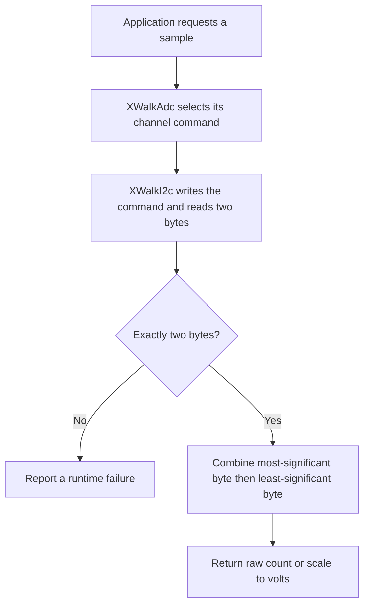

<!-- xwalk-page-header:start -->

[xWalk documentation](../../../index.md) / [8. xWalk guides](../../index.md) / `XWalkAdc`

**8. xWalk guides &middot; Module 02**

<!-- xwalk-page-header:end -->

# `XWalkAdc`

`XWalkAdc` reads one analog input through the Robot HAT microcontroller and exposes either a raw
sample or a voltage. Use it for signals such as reflected light or a potentiometer, then put sensor
calibration and application decisions above this layer. The class borrows an existing `XWalkI2c`;
it does not open a Linux device or own the bus.

## 1. Channels and electrical meaning

The C++ constructors accept numeric channels `0` through `7`, or names `A0` through `A7`.
These are logical MCU channels, not a promise of eight external connectors. SunFounder's V4 and
V5 hardware guides identify four exposed analog inputs, A0–A3, with A4 used for battery sensing.
Confirm the board revision and connector label before assigning a sensor.

The nominal conversion is twelve bits with a 3.3 V reference. An ADC voltage is the voltage at the
measurement input. For the documented A4 battery divider, board-control code multiplies this by
three; `readVoltage()` itself does not apply that divider. See the
[V4 hardware guide][board-v4] and [V5 hardware guide][board-v5].

## 2. How a sample is acquired

The channel command is `(7 - channel) | 0x10`; A0 therefore selects `0x17`. The current
implementation calls `writeRegisterThenRead()` with two zero payload bytes and requests two
response bytes. Keep that operation together when sharing the bus. The
[manufacturer's MCU reference][mcu] explains the command and high-byte-first sample format.

## 3. Reading and interpreting values

| Operation | Result or constraint |
|---|---|
| Constructor | An I2C reference, a validated channel, and an optional seven-bit address |
| `read()` | A `uint16` assembled from exactly two response bytes |
| `readVoltage()` | A new acquisition converted using `raw * 3.3 / 4095` |
| `channel()`, `address()`, `command()` | Inspect the configured channel, address, and MCU command |

A nominal count of 2048 converts to approximately 1.6504 V. Each nominal count corresponds to
about 0.806 mV; that is conversion resolution, not a guaranteed measurement accuracy. Reference
variation, sensor noise, wiring, and calibration still affect the result.

`read()` assembles the full sixteen-bit response and does not mask or reject values above 4095.
Treat values outside the nominal twelve-bit range as something for the application to diagnose;
do not assume the driver has clamped them. Also, calling `read()` followed by `readVoltage()` takes
two samples. Convert a saved count yourself when both representations must describe one acquisition.

## 4. Integration and troubleshooting

1. Create the backend and `XWalkI2c` before the ADC, and retain both until the ADC is destroyed.
2. Select an exposed channel and verify its input voltage against the board documentation.
3. Use an explicit address when deployment knows it. Automatic selection probes `0x14`, then `0x15`.
4. If neither candidate responds, the current ADC implementation selects `0x14` as a fallback.
   Construction is therefore not proof that the device is present.
5. Acquire samples at an application-selected rate and calibrate against the actual sensor and surface.

- A response-length failure indicates a transport or backend problem, not a valid zero reading.
- A constant endpoint reading can indicate saturation, wiring trouble, or a sensor at its limit.
- Averaging can reduce random variation, but it cannot correct an incorrect reference or wiring fault.
- Use the device-free ADC simulation before a physical test; it verifies byte order and conversion.

## 5. References

The [detailed ADC contract][module] and `xHal_Rpi5CarAdc.h` define the C++ API. The
[SunFounder ADC reference][upstream] supplies upstream context; its Python examples are not C++ calls.
External references checked on 2026-10-08.

[board-v4]: https://docs.sunfounder.com/projects/robot-hat-v4/en/latest/robot_hat_v4/hardware_introduction.html
[board-v5]: https://docs.sunfounder.com/projects/robot-hat-v4/en/latest/robot_hat_v5/hardware_introduction.html
[mcu]: https://docs.sunfounder.com/projects/robot-hat-v4/en/latest/robot_hat_v4/onboard_mcu.html
[module]: ../../../02-xwalk-hardware/xWalk-rpi5-hw/xWalkHal/device/xWalkAdc/xWalkAdc.md
[upstream]: https://docs.sunfounder.com/projects/robot-hat-v4/en/latest/api/api_adc.html

---

[Previous page](../../index.md) · [Chapter index](../../index.md) · [Next page](API%20Basic%20Class.md)
