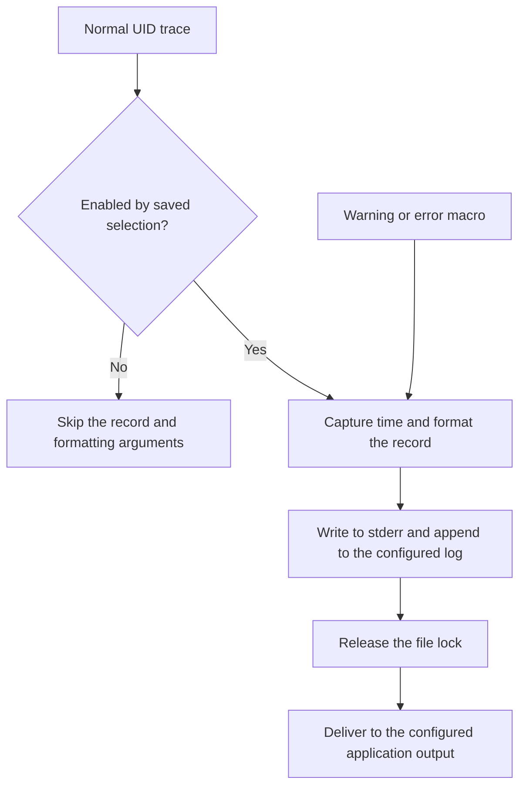

<!-- xwalk-page-header:start -->

[xWalk documentation](../../../index.md) / [8. xWalk guides](../../index.md) / `XWalkTrace`

**8. xWalk guides &middot; Module 11**

<!-- xwalk-page-header:end -->

# `XWalkTrace`

`XWalkTrace` provides diagnostics for hardware interfaces and the layers that coordinate them.
It helps answer which operation ran, where it ran, and which validation or backend failure occurred.
The C++ service is separate from the upstream `_Basic_class` logger: xWalk adds a generated UID
catalogue, saved trace selection, source locations, and application-owned output callbacks.

## 1. Two diagnostic interfaces

Normal project diagnostics use the macro family belonging to their source tree. A registered UID
identifies a specific trace site, and the catalogue decides whether it is enabled. Disabled normal
traces skip their formatting arguments. Warning and error macros remain available even when normal
UID traces are disabled.

Explicit `XWalkTrace` objects also expose severity-filtered methods such as `warning()` and `debug()`.
These use a threshold; they should not be confused with the UID selection used by normal project macros.
The compatibility severity order is critical, error, warning, info, and debug, with warning as the default.

| Source layer | Normal macro family | UID prefix |
|---|---|---|
| HAL | `XWALK_HAL_TRACE_UIDn` | `RPI` |
| Controller | `XWALK_CTRL_TRACE_UIDn` | `CTRL` |
| Driver | `XWALK_RPIAGENT_TRACE_UIDn` | `RPIAGENT` |
| Common library | `XWALK_LIB_TRACE_UIDn` | `LIB` |

The suffix `n` is the number of formatting arguments. Numeric IDs must be unique within their
prefix; the build scanner rejects duplicate or malformed declarations. Reuse the existing
catalogue when selecting a trace, rather than inventing an ID in a command.

## 2. Record flow

The normal build-local path is `<build-directory>/log/xWalkTrace.log`; an executable may configure
its own build-local log name. The destination does not follow the process working directory.
Formatted records go to stderr as well as the log; the callback is an additional application output.
Records include UTC wall time, monotonic elapsed time, source location, and the relevant UID or
category. Elapsed time is measured from the trace runtime's initialization; it is not automatically
the duration of the operation being logged.

## 3. Selecting useful output

Applications that expose `--trace` accept selectors such as `RPI.enable`, `RPI.disable`, and
`all.disable`, plus catalogue-known individual UIDs and configuration JSON. Changes are persisted
in the generated XML catalogue. A later launch loads those settings rather than requiring the
same flags again. Later applicable selectors override earlier ones.

- Enable one module while investigating a problem, then narrow to relevant UIDs.
- Keep warnings and errors in the diagnosis even when no normal traces appear.
- Verify the configured log path and saved selectors before concluding that an operation never ran.
- Use paired timestamps or explicit application timing to measure an operation's duration.

## 4. Ownership, error behavior, and log content

Callback contexts are non-owning. Keep them alive until logging can no longer invoke them, and
avoid slow or recursive work in an output callback. The optional callback runs after the file lock
is released, but logging is still synchronous and can contribute to caller latency.

Warning macros report a condition without throwing. Error behavior depends on the selector:
ordinary C++ error selectors log and throw the selected exception, while `XWALK_EXCEPTION`
records a non-throwing error. A diagnostic call is therefore not always a harmless print statement.

Keep messages focused on operation names, bounded numeric state, and failure categories. Do not
log credentials, microphone samples, private prompts, or complete provider payloads. Functional
CLI output and protocol responses retain their own format and must not acquire trace decoration.
Keep destructor, interrupt, and non-throwing actuator-cleanup paths free of new trace work.

## 5. References

Use the [trace module reference][module] and public trace headers for exact macro and callback
contracts. The [upstream basic logger page][upstream] explains the original logging concept, not
xWalk's UID catalogue or persistence behavior. External reference checked on 2026-10-08.

[module]: ../../../07-xwalk-trace/xWalk-rpi5-trace/xWalk-rpi5-trace.md
[upstream]: https://docs.sunfounder.com/projects/robot-hat-v4/en/latest/api/api_basic_class.html

---

[Previous page](API%20ADC.md) · [Chapter index](../../index.md) · [Next page](API%20Filedb.md)
