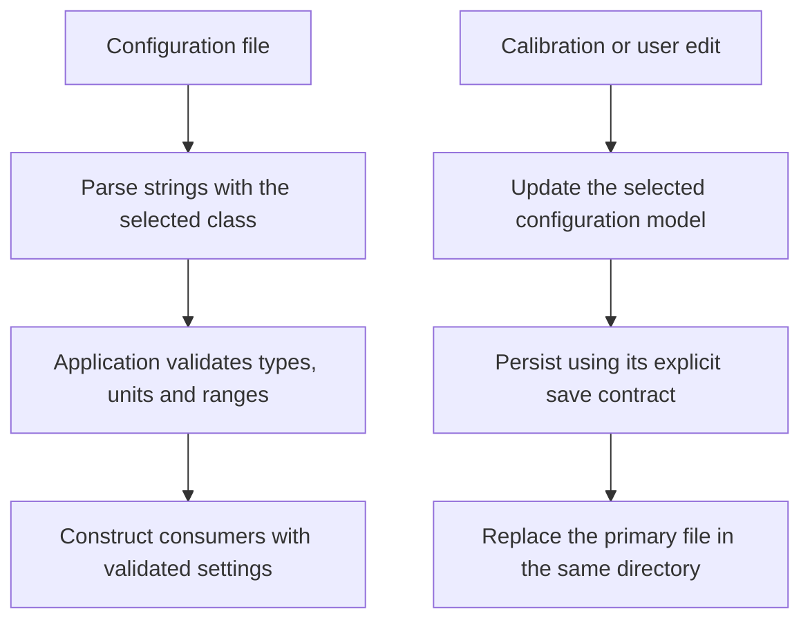

<!-- xwalk-page-header:start -->

[xWalk documentation](../../../index.md) / [8. xWalk guides](../../index.md) / `XWalkConfigStore` and `XWalkConfig`

**8. xWalk guides &middot; Module 03**

<!-- xwalk-page-header:end -->

# `XWalkConfigStore` and `XWalkConfig`

The `xWalkConfig` module keeps persistent settings separate from hardware operations. Use
`XWalkConfigStore` for flat string-key settings such as calibration offsets; use `XWalkConfig`
when a file needs named sections. Both own their filesystem paths and in-memory values, but they
have different parsing and persistence contracts.

Load configuration in the application composition root, convert strings to validated typed values,
and then construct hardware consumers. A motor does not open its own settings file. The articulated
`XWalkRobot` coordinator is a specific consumer of an injected `XWalkConfigStore` for servo offsets.

## 1. Choose the file model

| Requirement | `XWalkConfigStore` | `XWalkConfig` |
|---|---|---|
| Layout | Flat `key = value` entries | Options under `[section]` headers |
| Missing value | Return the supplied default | Insert the supplied default into memory |
| Mutation | `set()` persists the primary file | `set()` changes memory; `write()` persists |
| Reload | Read through the store contract | `read()` replaces memory and discards unsaved edits |
| Layered defaults | Restricted relative `.conf` includes | Do not assume the flat-store include grammar |
| Unrelated content | Retained during updates | Comments, blank lines, and unrelated text retained |

## 2. Configuration flow



The same-directory replacement avoids exposing a partially rewritten file during a normal update,
and the module preserves existing permission bits. This does not establish a multi-process
transaction or a guarantee of survival across power loss. Operations through one instance are
serialized; multiple instances or external writers need additional application synchronization.

## 3. Flat-store details that affect values

Unquoted values lose ASCII spaces for Robot HAT compatibility. Surround a value with double quotes
when spaces are meaningful; retrieval removes the quotes and keeps the enclosed spaces. For example,
`label = "front sensor"` retains the space, whereas the unquoted value becomes `frontsensor`.
Use single-line keys and values; keys must be non-empty and must not contain `=` or surrounding whitespace.

The last duplicate key wins when reading. An update replaces matching primary-file entries or
appends a missing entry. Included defaults remain untouched: runtime overrides belong in the
primary configuration file. Includes must remain below their including directory, use `.conf`,
avoid cycles and parent traversal, and stay within eight levels.

## 4. Section-aware editing

Options before the first section header belong to the empty default section. Named sections use
trimmed text without brackets or line terminators, and option names must not contain `=` or brackets.
Call `write()` after making intended edits; calling `read()` first intentionally discards them.

An illustrative section-aware file is:

```ini
[motion]
speed_percent = 25

[sensing]
sample_interval_ms = 100
```

These are example application keys, not automatically recognized motor or sensor settings.
The application decides what they mean and rejects invalid numeric values before using them.

## 5. Recovery and verification

- Keep calibration separate from factory defaults so replacing software does not erase tuning.
- Back up the primary file before an intentional reset or migration.
- Treat a parse or write failure as a configuration failure; do not silently overwrite the file with defaults.
- Review directory permissions in deployment even though the flat store can create missing parents.
- Exercise changes with the build-local configuration simulation before using deployed settings.

## 6. References

The [configuration module reference][module] documents both C++ classes. The
[SunFounder FileDB example][upstream] provides the flat-store background; section-aware editing,
include restrictions, and replacement-file behavior above are xWalk implementation contracts.
External reference checked on 2026-10-08.

[module]: ../../../02-xwalk-hardware/xWalk-rpi5-hw/xWalkHal/interface/xWalkConfig/xWalkConfig.md
[upstream]: https://docs.sunfounder.com/projects/robot-hat-v4/en/latest/api/api_filedb.html

---

[Previous page](API%20Basic%20Class.md) · [Chapter index](../../index.md) · [Next page](API%20I2C.md)
