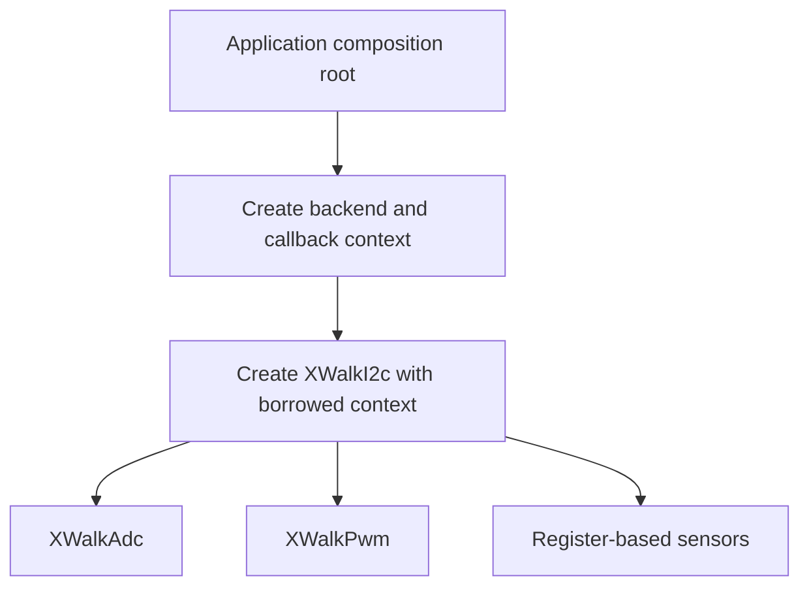

<!-- xwalk-page-header:start -->

[xWalk documentation](../../../index.md) / [8. xWalk guides](../../index.md) / `XWalkI2c`

**8. xWalk guides &middot; Module 05**

<!-- xwalk-page-header:end -->

# `XWalkI2c`

`XWalkI2c` is the callback-driven bus interface shared by ADC, PWM, firmware, and sensor code.
It validates requests and delegates transport to a caller-owned backend. `XWalkI2cLinux` provides
the optional Linux implementation and owns its file descriptor; the core interface owns no device.
This boundary lets host tests exercise the same consumers with an in-memory bus.

## 1. Composition and lifetime

The arrows show construction dependencies. Destroy consumers before the interface, and destroy
the interface before its backend. Sharing an interface does not transfer ownership to any consumer.
The Linux backend serializes its transactions; application-level sequences spanning several calls
may still need a wider lock.

## 2. Select the transaction by protocol

| Operation | Intended use |
|---|---|
| `probe()` | Ask whether a validated address responds |
| `writeRegister()` | Send a register and payload using the backend's encoding |
| `read()` | Read a positive number of bytes in bus order |
| `readRegister()` | Select a register and read its data as one backend operation |
| `writeRegisterThenRead()` | Send a command payload, then acquire a response under one transaction boundary |
| `tryWriteRegister()` | Non-throwing status path for best-effort actuator shutdown |

ADC command acquisition and an accelerometer register read are different protocols. Use the
operation expected by the device rather than combining unrelated calls that happen to work in a
single-threaded example. A host backend must preserve the same ordering and response lengths.

## 3. Linux transport and addressing

Linux exposes adapters through `/dev/i2c-N`. The selected device path is deployment configuration;
the kernel documentation warns that adapter numbering can vary. An address is a device selector,
not a register number. xWalk uses seven-bit addresses at this interface, so pass an unshifted
value such as `0x14`, not an address with a read/write bit appended.

The kernel distinguishes plain reads and writes, SMBus operations, and combined `I2C_RDWR`
transactions. A logical xWalk transaction preserves the required application-level ordering,
but its precise bus transfer depends on the selected backend and device protocol. Do not infer
a repeated START merely from a C++ method name. See the [Linux I2C userspace reference][kernel].

## 4. Failure handling and concurrency

Request validation rejects invalid lengths or unsupported operations before consumers can index
response data. Optional callbacks must be present before their corresponding operations are used.
Ordinary transfer failures propagate through the documented error contract. The safe-write method
instead returns `false` when input is invalid, support is missing, or the backend cannot complete the write.

- Keep register selection and its associated read inside one backend transaction.
- Serialize a larger sequence when its meaning depends on several calls staying together.
- Do not interleave direct Linux descriptor access with the interface's locked operations.
- Treat a failed zero-output write as an incomplete shutdown, even if later independent outputs succeed.
- Probe only the addresses and operations appropriate to the connected device during physical diagnosis.

## 5. Host verification and references

The host simulation injects a device mirror beneath the Linux backend. It exercises validation,
address selection, transfer encoding, and retries without opening a physical bus. This verifies
software behavior, not wiring, electrical timing, or the presence of a real HAT.

Read the [I2C module contract][module] for callback signatures and build commands. The
[Robot HAT MCU reference][mcu] describes why ADC and PWM communicate through I2C.
External references checked on 2026-10-08.

[kernel]: https://docs.kernel.org/i2c/dev-interface.html
[module]: ../../../02-xwalk-hardware/xWalk-rpi5-hw/xWalkHal/interface/xWalkI2c/xWalkI2c.md
[mcu]: https://docs.sunfounder.com/projects/robot-hat-v4/en/latest/robot_hat_v4/onboard_mcu.html

---

[Previous page](API%20Filedb.md) · [Chapter index](../../index.md) · [Next page](API%20Modules.md)
