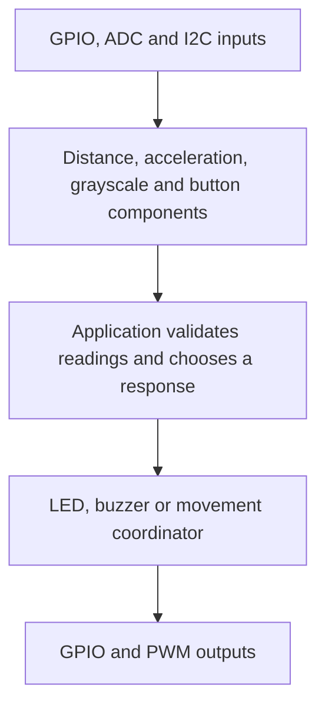

<!-- xwalk-page-header:start -->

[xWalk documentation](../../../index.md) / [8. xWalk guides](../../index.md) / Sensors and actuators

**8. xWalk guides &middot; Module 51**

<!-- xwalk-page-header:end -->

# Sensors and actuators

These components convert low-level I2C, ADC, PWM, and GPIO operations into meaningful observations
or outputs. The application creates those dependencies first and passes them by reference.
Keeping acquisition separate from decisions lets a host simulation test a robot behavior without
moving a motor, lighting an LED, or producing sound.

## 1. From observation to action

Sensor APIs report measurements and failure states; the application owns filtering, scheduling,
and the response to a missing observation. Avoid interpreting every returned number as a valid
physical measurement. In particular, ultrasonic failure sentinels need separate handling.

## 2. Distance: `XWalkUltrasonic`

The ultrasonic component borrows trigger and echo GPIO objects. It configures the trigger as an
output and the echo as a pull-down input, then measures the round-trip echo interval. Successful
results are centimetres. The conceptual relation is `distance = sound speed * travel time / 2`;
the division by two accounts for the outward and return path.

| Result | Meaning | Application response |
|---|---|---|
| Non-negative measurement | Completed pulse in centimetres | Apply the valid-distance policy |
| `-1.0` | Timeout | Track the missing observation; only this sentinel is retried by the component |
| `-2.0` | Invalid or incomplete pulse | Diagnose without treating it as a clear path |

The optional GPIO pulse callbacks use captured edge timestamps. A backend without them uses the
polling path. Serialize acquisition, keep timeouts bounded, and do not renew a cached sample's
freshness merely because another caller reads it. See the [ultrasonic contract][ultrasonic].

## 3. Acceleration: `XWalkAdxl345`

This I2C component exposes raw and converted acceleration. The current implementation discards
the first acquisition for each returned axis, decodes the next sample as signed little-endian
sixteen-bit data, and scales by 256 counts per unit of standard gravity. A stationary sensor still
observes gravity; an axis result is not directly a speed or travelled distance.

- Keep the physical axis orientation consistent with the application's coordinate system.
- Distinguish raw counts, units of gravity, and any later conversion to metres per second squared.
- Use the documented configured range and scale; do not apply a different sensor-mode scale blindly.

The [ADXL345 module reference][accelerometer] defines the configured C++ behavior.

## 4. Surface sensing: `XWalkGrayscaleModule` and `XWalkLineTracker`

Create three ADC objects in left, middle, right order. The grayscale layer applies calibration,
and the tracker derives channel classifications and normalized line position. Ambient light,
mounting height, surface reflectivity, and sensor alignment all affect useful calibration.

The implementation uses strict comparisons: a cliff reading is below its threshold; line detection
requires spread greater than the configured difference; equality with a grayscale reference is
classified as black. Test boundary values as well as obvious dark and light readings. Store
calibration explicitly and keep it tied to the sensor arrangement. See the [line-tracker contract][tracker].

## 5. Light and sound outputs

`XWalkLed` borrows one GPIO. Direct changes and replacement blink requests stop and join an existing
blink worker. `XWalkRgbLed` borrows red, green, and blue PWM channels and accepts component values,
packed `0xRRGGBB`, or supported hexadecimal text. Common-anode output inverts each component
before scaling; common-cathode output does not. See the [LED reference][led].

`XWalkBuzzer` has distinct GPIO and PWM constructors. An active buzzer is switched on and off through
GPIO; a passive buzzer uses PWM frequency to determine pitch. Passive on/off uses 50%/0% duty.
Choose a timer separate from fixed-frequency servos when changing pitch, and explicitly turn off a
continuous tone. Its destructor does not perform hardware shutdown. See the [buzzer reference][buzzer].

## 6. User input: `XWalkUserButton`

The button monitor borrows a pull-up GPIO and interprets the input as active-low. It polls at
50 ms intervals; the first sample after start establishes a baseline without generating an event.
The long-press threshold is clamped to 2–5 seconds and captured when the press begins.

- Keep callbacks short and non-throwing; they run on the monitoring worker.
- Keep callback contexts alive until the registration is cleared and the worker is joined.
- Do not stop or destroy the monitor from its own callback.
- Distinguish polling and debounce behavior from an exact hardware interrupt timestamp.

See the [button contract][button] for event and lifetime details.

## 7. References and safe verification

Use the module-specific host simulations with deterministic input sequences, including timeout,
boundary, and invalid-data cases. Physical tests require the correct board and sensor wiring.
The [SunFounder modules reference][upstream] describes the upstream sensor and actuator concepts;
the xWalk references above define the C++ ownership, failure, and concurrency contracts.
External reference checked on 2026-10-08.

[ultrasonic]: ../../../02-xwalk-hardware/xWalk-rpi5-hw/xWalkHal/device/xWalkUltrasonic/xWalkUltrasonic.md
[accelerometer]: ../../../02-xwalk-hardware/xWalk-rpi5-hw/xWalkHal/device/xWalkAdxl345/xWalkAdxl345.md
[tracker]: ../../../02-xwalk-hardware/xWalk-rpi5-hw/xWalkHal/sensor/xWalkLineTracker/xWalkLineTracker.md
[led]: ../../../02-xwalk-hardware/xWalk-rpi5-hw/xWalkHal/sensor/xWalkLed/xWalkLed.md
[buzzer]: ../../../02-xwalk-hardware/xWalk-rpi5-hw/xWalkHal/sensor/xWalkBuzzer/xWalkBuzzer.md
[button]: ../../../02-xwalk-hardware/xWalk-rpi5-hw/xWalkHal/device/xWalkUserButton/xWalkUserButton.md
[upstream]: https://docs.sunfounder.com/projects/robot-hat-v4/en/latest/api/api_modules.html

---

[Previous page](API%20I2C.md) · [Chapter index](../../index.md) · [Next page](API%20Motor.md)
