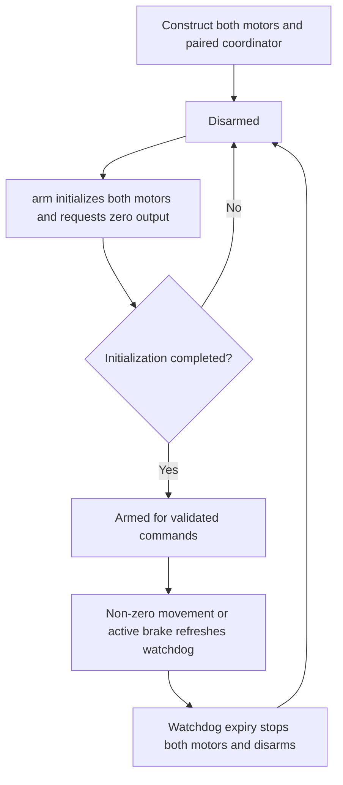

<!-- xwalk-page-header:start -->

[xWalk documentation](../../../index.md) / [8. xWalk guides](../../index.md) / `XWalkMotor` and `XWalkMotors`

**8. xWalk guides &middot; Module 06**

<!-- xwalk-page-header:end -->

# `XWalkMotor` and `XWalkMotors`

`XWalkMotor` converts one signed power command into the PWM and direction signals required by a
motor driver. `XWalkMotors` assigns two existing motor objects to left and right roles and adds
coordinated commands, arming, and a process-local watchdog. Neither class owns its injected
hardware dependencies or opens a configuration file.

## 1. Select the driver mode explicitly

| Operation | PWM plus direction GPIO | Dual PWM |
|---|---|---|
| Forward | Speed PWM and high direction | Forward PWM active, reverse PWM zero |
| Reverse | Speed PWM and low direction | Forward PWM zero, reverse PWM active |
| Stop | Speed PWM zero | Both PWM outputs zero |
| Electrical brake | Unsupported | Both PWM outputs at 100% |

The overload chosen at construction defines the mode. Match it to the actual HAT revision and
motor wiring. The manufacturer separates V4 and V5 hardware layouts, so do not select a mode
from a generic product name alone. See the [V4][board-v4] and [V5][board-v5] hardware references.

Speed commands must be finite and within -100 to 100 percent. Sign selects direction and magnitude
selects duty; this is requested electrical power, not measured RPM. Wiring, load, battery voltage,
and friction can change motion at the same setting. Reversal configuration swaps direction without
changing the command's magnitude.

## 2. Initialization and movement

Single-motor construction binds and validates dependencies without doing PWM or GPIO I/O.
Call its idempotent `initialize()` before speed or brake commands. At the paired level, `arm()`
initializes both motors and establishes zero output; failed initialization leaves the pair disarmed.
This statement concerns motor construction: constructing a lower-level PWM dependency can itself
configure MCU timer registers.

Paired commands validate both requested speeds before changing either motor. That prevents a bad
second argument from causing an avoidable one-sided update. It is not a hardware transaction:
a bus failure during successive valid writes can still leave outputs only partly updated.

## 3. Watchdog and explicit shutdown

A valid non-zero movement or active brake refreshes the watchdog. `heartbeat()` refreshes an
active command, while `heartbeatSafely()` reports status at a non-throwing boundary. Invalid
commands do not extend the deadline. Expiry and a backward clock discontinuity stop and disarm
the pair. Tests can inject a clock; deployment normally uses the worker that checks expiry.

- Use explicit stopping as the normal shutdown path.
- `stop()` reports an incomplete shutdown through the ordinary failure contract.
- `stopSafely()` makes independent best-effort zero-output attempts without throwing.
- A dual-PWM stop attempts both channels; a paired stop attempts both motors even after an earlier failure.
- Destructors make final safe-stop attempts but cannot guarantee that failed hardware actually stopped.

The watchdog runs in this process. It cannot guarantee a stop after process termination, a complete
stall, a kernel failure, or a power-path fault. Initial physical testing needs raised wheels and
a reachable power cut-off. A zero command and electrical braking are different driver states.

## 4. Configuration and diagnosis

Load role, reversal, and watchdog settings in the application and pass the validated
`XWalkMotorsConfiguration`. Keep the configuration store, bus, PWM channels, GPIO backends, and
motor objects alive in dependency order. Shut the paired coordinator down before releasing them.

- Wrong direction: inspect role assignment, reversal settings, and wiring before increasing power.
- Unexpected disarming: inspect elapsed time and heartbeat scheduling before changing the timeout.
- One-sided response: verify both backend write results and that the configured mode matches the board.
- Timer interference: check shared PWM groups before mixing motors with servos or a passive buzzer.

## 5. References

The [motor module contract][module] is authoritative for the C++ lifecycle and watchdog. The
[SunFounder motor reference][upstream] provides upstream movement context. xWalk's explicit
initialization, arming, and failure-reporting behavior must be preserved when adapting examples.
External references checked on 2026-10-08.

[board-v4]: https://docs.sunfounder.com/projects/robot-hat-v4/en/latest/robot_hat_v4/hardware_introduction.html
[board-v5]: https://docs.sunfounder.com/projects/robot-hat-v4/en/latest/robot_hat_v5/hardware_introduction.html
[module]: ../../../02-xwalk-hardware/xWalk-rpi5-hw/xWalkHal/sensor/xWalkMotor/xWalkMotor.md
[upstream]: https://docs.sunfounder.com/projects/robot-hat-v4/en/latest/api/api_motor.html

---

[Previous page](API%20Modules.md) · [Chapter index](../../index.md) · [Next page](API%20Music.md)
