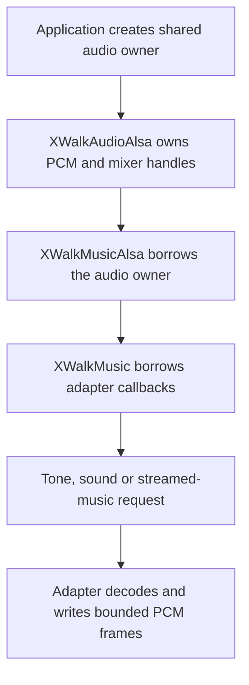

<!-- xwalk-page-header:start -->

[xWalk documentation](../../../index.md) / [8. xWalk guides](../../index.md) / `XWalkMusic`

**8. xWalk guides &middot; Module 07**

<!-- xwalk-page-header:end -->

# `XWalkMusic`

`XWalkMusic` handles note frequencies, musical timing, PCM tone generation, and audio commands.
The core delegates output through an injected `XWalkMusicCallbacks` table. It does not own an
ALSA device or launch a player process. This lets the same API use a silent recording backend
for tests and a platform adapter for real audio.

## 1. Separate musical values from playback

| Concept | Unit or behavior |
|---|---|
| Tempo | Beats per minute; default 120 quarter-note beats per minute |
| Time signature | Default 4/4 |
| Note frequency | Hertz; A4 is 440 Hz |
| Beat duration | Seconds, derived from tempo and the selected note value |
| Generated PCM | Mono, signed 16-bit little-endian, 44,100 samples per second |
| Output volume | Validated percentage passed through the selected audio operations |

With the default quarter-note beat, 120 BPM gives 0.5 seconds per quarter note. Note frequency
uses equal temperament relative to MIDI note 69: `frequency = 440 * 2^((note - 69) / 12)`.
Use `noteFrequencyHz()` and `beatDurationSeconds()` for the corresponding C++ conversions.
The exact accepted names, MIDI range, and key syntax belong to the public header contract.

## 2. Audio ownership

Create dependencies in this order and destroy them in reverse. All core callback entries are
required and validated before construction invokes `enableOutput`. Construction can therefore
activate output; it is not merely an allocation. Destroying `XWalkMusic` does not disable or
release the caller-owned backend.

The optional ALSA adapter retains at most one background-sound worker and one streamed-music
worker. It writes bounded chunks and observes transport controls between writes. Keep the adapter
and shared audio owner alive until playback workers have been stopped and joined.

## 3. Tone duration compatibility

The current tone generator deliberately preserves a non-obvious compatibility rule. It halves
the requested duration, truncates the resulting sine-wave frame count, and then appends
`frameCount % 44100` silent frames. Consequently, requested duration is not a universal promise
of the output buffer's duration, particularly for longer requests.

For a 1-second request, the generator produces 22,050 sine frames and 22,050 silent frames.
The buffer contains 44,100 mono frames, or 88,200 bytes. For a 2-second request, it produces
44,100 sine frames and no appended silence: the buffer is only one second long. Use the actual
frame count when calculating playback duration or scheduling a following action.

## 4. Files, formats, and transport

The built-in adapter decoder accepts uncompressed sixteen-bit PCM RIFF/WAVE with one through
eight channels. Compressed formats require the optional libsndfile decoder and the formats that
its installed build supports. A filename extension alone does not prove that decoding is available.

- Select PCM device, mixer device, and element through deployment settings; do not assume card zero.
- Validate durations, frequencies, loop counts, offsets, and volume before playback.
- Distinguish stopping streamed music from turning shared speaker power off.
- Account for sound effects that temporarily change the shared mixer volume.
- Use the silent host simulation to verify callbacks and tone bytes before a low-volume physical test.

## 5. References

See the [music module reference][module] for accepted values, callback signatures, decoder limits,
and transport behavior. The [SunFounder music guide][upstream] supplies the upstream tone, beat,
and playback concepts; its Python dependencies and setup commands do not define this C++ backend.
External reference checked on 2026-10-08.

[module]: ../../../02-xwalk-hardware/xWalk-rpi5-hw/xWalkHal/layer1/xWalkMusic/xWalkMusic.md
[upstream]: https://docs.sunfounder.com/projects/robot-hat-v4/en/latest/api/api_music.html

---

[Previous page](API%20Motor.md) · [Chapter index](../../index.md) · [Next page](API%20PWM.md)
