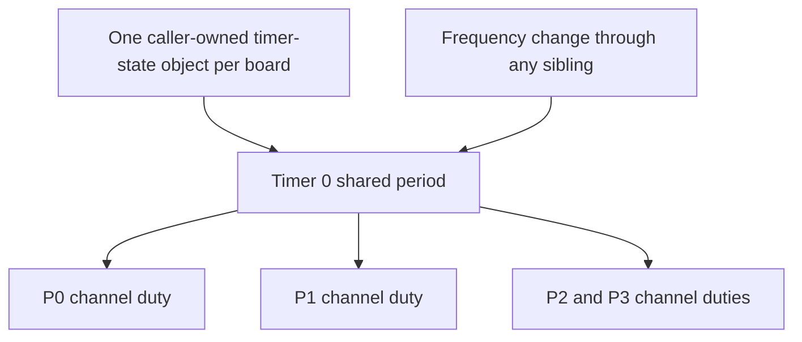

<!-- xwalk-page-header:start -->

[xWalk documentation](../../../index.md) / [8. xWalk guides](../../index.md) / `XWalkPwm` and `XWalkPwmTimerState`

**8. xWalk guides &middot; Module 08**

<!-- xwalk-page-header:end -->

# `XWalkPwm` and `XWalkPwmTimerState`

`XWalkPwm` controls one logical Robot HAT PWM channel over an existing `XWalkI2c` interface.
`XWalkPwmTimerState` stores the periods shared by channels using the same timer. PWM has two
different settings: frequency determines repetition rate, while duty cycle determines the active
fraction of each cycle. A servo's pulse duration and a motor's power percentage use that signal
differently, so choose settings for the connected device.

## 1. Shared timers are a hardware constraint

A frequency change affects every output attached to that timer. The current timer-state class
protects period reads and updates with a mutex; it does **not** track active channel owners or
reject incompatible sibling frequencies. The application must allocate compatible devices to
each timer and serialize reconfiguration. A passive buzzer that changes pitch should not share
a timer with a servo that needs a fixed frame rate.

| C++ logical channels | Timer index |
|---|---:|
| P0–P3 | 0 |
| P4–P7 | 1 |
| P8–P11 | 2 |
| P12–P15 | 3 |
| P16–P17 | 4 |
| P18 | 5 |
| P19 | 6 |

This is the implementation's twenty-channel mapping, not the connector count of every Robot HAT.
The [V4 MCU documentation][mcu] describes fourteen outputs with four timers, including motor outputs.
Select only channels implemented by the actual board and firmware. Do not infer additional physical
outputs from the fact that a constructor accepts their names.

## 2. Operations and units

| Operation | Accepted value or effect |
|---|---|
| Constructor | Channel `0`–`19` or `P0`–`P19`, I2C reference, address, shared timer state |
| `setFrequency()` | Positive finite Hertz with representable timer settings |
| `setPeriod()` | Rounded timer period, 1–65,535 counts |
| `setPrescaler()` | Rounded divider, 1–65,536 |
| `setPulseWidth()` | Finite raw count, 0–65,535; fractional part is truncated |
| `setPulseWidthPercent()` | Finite percentage, 0–100, converted using the shared period |
| `trySetPulseWidthPercent()` | Non-throwing output attempt; inspect its Boolean result |

Construction configures the default requested 50 Hz frequency. Construct every sibling and plan
timer settings before enabling attached outputs; constructing a later channel can reconfigure a
timer already used by an earlier one. Keep both the bus and shared state alive longer than all channels.

## 3. Counts, percentages, and pulse duration

For the percentage API, `pulse counts = trunc(period * percent / 100)`. A period of 4095 and
25% duty therefore produce 1023 counts. The raw count setter checks the sixteen-bit range but
does not enforce `pulse <= period`; callers must apply that constraint when using ordinary duty
cycles. Prefer the percentage method for motor or LED power and the servo abstraction for servo angles.

At 50 Hz a cycle is 20 ms, so a 1.5 ms pulse represents 7.5% duty. That explains why changing
frequency while retaining a duty percentage also changes a servo pulse's duration. Raw register
formulas use hardware-specific counter encodings; do not mix a datasheet register value with the
API's prescaler divisor without accounting for the implementation's conversion.

## 4. Failure handling and verification

The shared period is synchronized, but each PWM object's cached frequency and prescaler are not
a global readback of all sibling changes. I2C operations can fail after software state has changed;
an accessor alone is not proof of the waveform currently present on the connector.

- Reserve timer groups by function and document their owners.
- Set outputs inactive before intentional reconfiguration of a shared timer.
- Check status from best-effort zero-output writes and retain an independent shutdown path.
- Use the host simulation for encoding and validation; use physical measurement for actual timing.

## 5. References

The [detailed PWM reference][module] and implementation define the C++ mapping and validation.
The [manufacturer's MCU explanation][mcu] supplies the V4 timer-sharing background.
External reference checked on 2026-10-08.

[mcu]: https://docs.sunfounder.com/projects/robot-hat-v4/en/latest/robot_hat_v4/onboard_mcu.html
[module]: ../../../02-xwalk-hardware/xWalk-rpi5-hw/xWalkHal/device/xWalkPwm/xWalkPwm.md

---

[Previous page](API%20Music.md) · [Chapter index](../../index.md) · [Next page](API%20Pin.md)
