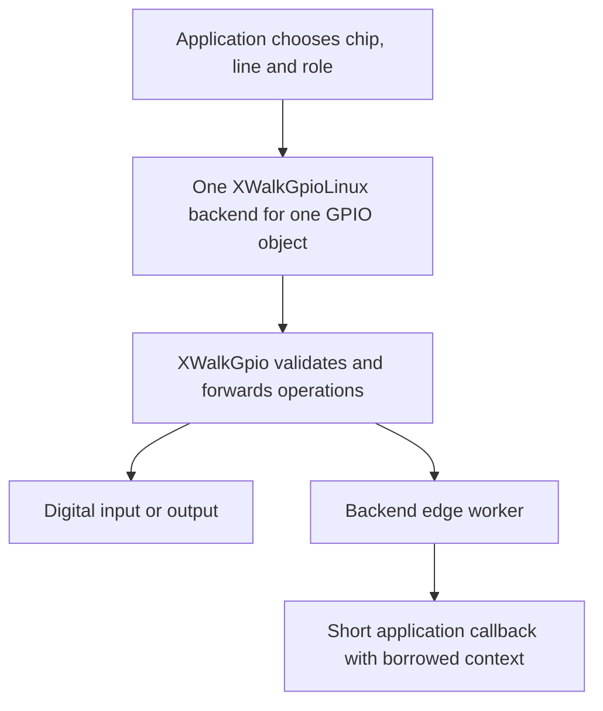

<!-- xwalk-page-header:start -->

[xWalk documentation](../../../index.md) / [8. xWalk guides](../../index.md) / `XWalkGpio`

**8. xWalk guides &middot; Module 04**

<!-- xwalk-page-header:end -->

# `XWalkGpio`

`XWalkGpio` represents one digital line with mode, pull, polarity, value, and edge operations.
It borrows a backend context and callback table. The optional `XWalkGpioLinux` backend owns the
Linux chip and line resources. The application chooses the physical line and its purpose before
passing the GPIO object to a motor direction input, button, LED, or ultrasonic component.

## 1. Pin names are not connector positions

Board aliases such as `D0` and `USER`, Raspberry Pi GPIO numbers, and physical header positions
are different naming systems. Confirm the alias mapping and HAT revision before wiring. For
example, the manufacturer's V4 table maps D0 to GPIO17; this does not mean physical header pin 17.
The [V4 hardware guide][board-v4] supplies its connector mapping.

The Linux backend takes a deployment-selected chip path and optional exact chip identity checks.
Do not assume that `/dev/gpiochip0` always identifies the required controller on every Raspberry Pi
or kernel. xWalk does not solve a wrong-chip selection by scanning and claiming a different line.

## 2. Ownership and event flow

Create the backend before its GPIO object and keep it alive until the object and event activity
have finished. Do not share one Linux backend between independent GPIO objects: it owns the line
request and event worker for that object. Cancel registrations before destroying callback contexts.

## 3. Mode, pull, and polarity

| Setting | Meaning |
|---|---|
| Input | Observe a digital level from the external circuit |
| Output | Drive the configured logical level |
| Pull-up or pull-down | Select the supported bias for an otherwise undriven input |
| Active polarity | Relate logical active/inactive state to the electrical level |
| Edge selection | Request rising, falling, or both transitions |

The compatibility API defaults to output mode and low value. Reading an output changes it to
input, and writing an input changes it to output. These are observable reconfigurations, not
passive accessor calls. Avoid reading a motor direction output merely as a debugging convenience.
Choose pull and polarity deliberately for active-low buttons and board control signals.

## 4. Events and pulse measurements

The general interrupt interface defaults to 200 ms debounce. Its backend worker uses kernel
monotonic timestamps, and application handlers run on that worker rather than a processor ISR.
They must not throw or block indefinitely. Queue expensive work for an owning application thread.

The optional `beginPulse` and `readPulse` callbacks serve bounded pulse acquisition, including
ultrasonic echo timing. Arm capture before triggering, serialize measurements, and distinguish
this path from a general debounced button callback. Reconfiguring or closing the GPIO releases
its pulse registration.

The current Linux implementation uses GPIO character-device ABI v1. The kernel now documents v1
as obsolete and recommends v2 for new userspace clients; this guide does not claim that xWalk has
already migrated. See the [kernel v1 reference][kernel-v1] and [current v2 interface][kernel].

## 5. Troubleshooting and references

- A chip identity mismatch should stop initialization before claiming a line.
- An apparently inverted signal may be a polarity mismatch rather than a broken input.
- Missed short events may reflect debounce, polling, scheduling, or the selected acquisition path.
- A requested output does not establish electrical compatibility with a 5 V peripheral.
- The host mirror verifies digital I/O without opening hardware; wiring needs separate verification.

Use the [GPIO module contract][module] for exact aliases, callbacks, and deployment parameters.
External references checked on 2026-10-08.

[board-v4]: https://docs.sunfounder.com/projects/robot-hat-v4/en/latest/robot_hat_v4/hardware_introduction.html
[kernel-v1]: https://docs.kernel.org/userspace-api/gpio/chardev_v1.html
[kernel]: https://docs.kernel.org/userspace-api/gpio/chardev.html
[module]: ../../../02-xwalk-hardware/xWalk-rpi5-hw/xWalkHal/interface/xWalkGpio/xWalkGpio.md

---

[Previous page](API%20PWM.md) · [Chapter index](../../index.md) · [Next page](API%20Robot.md)
