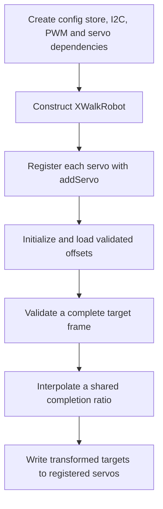

<!-- xwalk-page-header:start -->

[xWalk documentation](../../../index.md) / [8. xWalk guides](../../index.md) / `XWalkRobot`

**8. xWalk guides &middot; Module 09**

<!-- xwalk-page-header:end -->

# `XWalkRobot`

`XWalkRobot` coordinates an articulated robot made from caller-created `XWalkServo` objects.
It stores logical positions, applies calibration and coordinate transforms, interpolates movement,
and executes named action frames. It is a multi-servo coordinator; PiCar-X wheel movement belongs
to the motor and vehicle layers.

The robot borrows an `XWalkConfigStore` for persistent servo offsets. It does not use
`XWalkConfig` for that contract and does not construct the servo, PWM, or I2C dependencies internally.
This keeps the same movement logic available to an in-memory simulation.

## 1. Register, then initialize

Register between one and twelve servos before `initialize()`. Registration order defines frame
order, and registration after initialization is rejected. Keep the configuration store and every
servo alive longer than the robot; keep each servo's PWM and I2C dependencies alive longer still.
Initialization can issue physical servo commands, so choose safe starting positions first.

For example, a two-joint model uses two `addServo()` calls in a fixed order. Every target frame
then contains exactly two angles in that same order. A correctly sized frame with swapped joint
meanings is still an application error, even if both numbers are within range.

## 2. Positions and calibration

| Value | Responsibility |
|---|---|
| Logical position | The application's requested joint angle in degrees |
| Origin | A per-servo reference used by relative positioning |
| Direction multiplier | Maps the logical axis to the installed servo orientation |
| Calibration offset | Compensates mounting alignment; clamped to -20 through 20 degrees |
| Persisted key | `<robot-name>_servo_offset_list` in the injected flat store |

Keep these roles distinct. A calibration offset should correct a small mounting difference;
it should not hide an incorrect joint order or an unsafe mechanical range. Persisted offset lists
must parse correctly and match the registered servo count. Changing the robot name selects a
different offset key, so retain a stable name when calibration should survive software updates.

## 3. Coordinated movement and actions

Movement uses a shared interpolation ratio for all registered joints. Each step advances the
logical positions together, while actual PWM writes occur sequentially. This coordinates the
commanded trajectory but does not provide simultaneous electrical updates or feedback confirming
the achieved joint position.

The implementation uses a 10 ms interpolation interval and a maximum speed constant of
428 degrees per second. That constant is a software timing model, not a guarantee for every
servo, supply, or load. Speed-based and BPM-based moves remain subject to actuator and mechanical limits.
At least one interpolation step is used even when the calculated duration is very short.

Named actions contain ordered full-servo frames and a repetition request. Validate frame length,
finite values, origins, and direction settings before execution. Complete-frame validation prevents
bad input from intentionally updating only a subset of joints, but a backend failure during writes
can still leave a partially executed physical move.

## 4. Integration checklist

1. Map each logical joint to a known servo connector and record the registration order.
2. Allocate compatible PWM timers and choose conservative startup positions.
3. Load and inspect calibration before enabling a movement sequence.
4. Exercise frames through the host simulation, including incorrect lengths and invalid offsets.
5. Verify mechanical clearance with the actual robot before increasing travel or repetition.
6. Finish motion and release the coordinator before destroying its borrowed dependencies.

The Robot build can compile its Servo, PWM, and I2C hardware dependencies, but it does not register
an automatic arbitrary-robot motion test. A successful host simulation cannot establish collision
clearance or sufficient torque for a physical mechanism.

## 5. References

The [robot module reference][module] and `xHal_Rpi5CarRobot.h` define the registration and movement
contracts. The [SunFounder Robot example][upstream] supplies the upstream named-frame concept;
its implicit construction differs from xWalk's explicit dependency registration.
External reference checked on 2026-10-08.

[module]: ../../../02-xwalk-hardware/xWalk-rpi5-hw/xWalkHal/layer1/xWalkRobot/xWalkRobot.md
[upstream]: https://docs.sunfounder.com/projects/robot-hat-v4/en/latest/api/api_robot.html

---

[Previous page](API%20Pin.md) · [Chapter index](../../index.md) · [Next page](API%20Servo.md)
