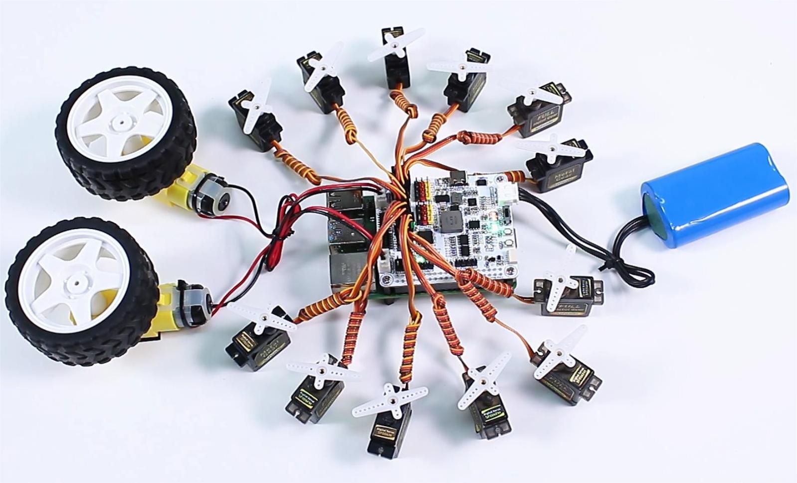

<!-- xwalk-page-header:start -->

[xWalk documentation](../../../index.md) / [8. xWalk guides](../../index.md) / Control servos and motors

**8. xWalk guides &middot; Module 25**

<!-- xwalk-page-header:end -->

# Control servos and motors

Create the I2C backend, I2C interface, PWM timer states, PWM channels, servos,
and motors in that order. Coordinated servo motion belongs to `XWalkRobot`;
paired motor validation belongs to `XWalkMotors`.

## 1. Image: Servo and motor arrangement

Servo channels normally require 50 hertz. Do not place a changing-frequency
load on the same timer. Sequence high-current startup and restrain the vehicle
before hardware testing.

---

[Previous page](Install%20I2S%20for%20Speaker.md) · [Chapter index](../../index.md) · [Next page](Controller%20Command%20Flow.md)
