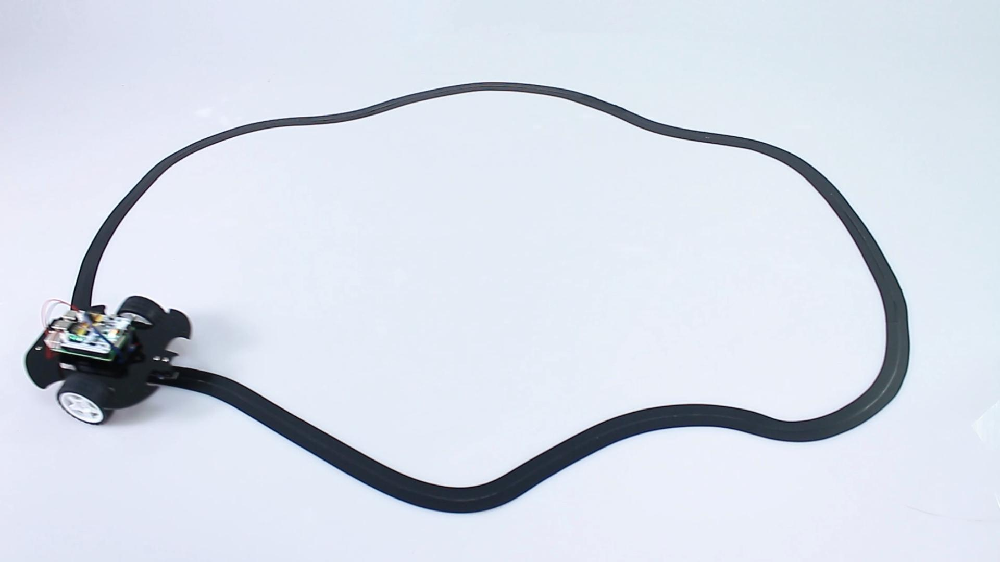

<!-- xwalk-page-header:start -->

[xWalk documentation](../../../index.md) / [8. xWalk guides](../../index.md) / C++ line-following car

**8. xWalk guides &middot; Module 15**

<!-- xwalk-page-header:end -->

# C++ line-following car

Create three `XWalkAdc` objects, `XWalkGrayscaleModule`, `XWalkLineTracker`, two
`XWalkMotor` objects, and one `XWalkMotors` coordinator.

## 1. Image: Line-following vehicle

Each bounded control cycle should read calibrated values, classify sensor state,
calculate line position, derive two validated speed commands, update both motors,
and wait for the application-defined interval. Stop both motors after invalid
calibration, sensor failure, cliff detection, or shutdown.

---

[Previous page](API.md) · [Chapter index](../../index.md) · [Next page](Project%20Plant%20Monitor.md)
