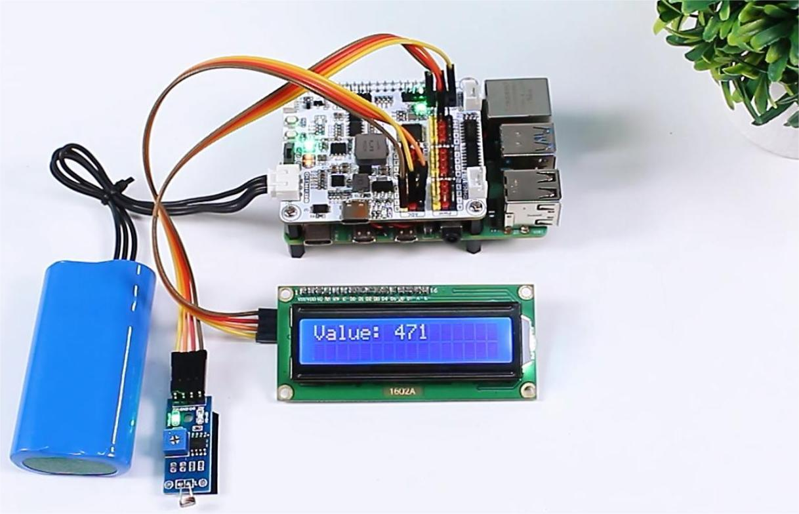

<!-- xwalk-page-header:start -->

[xWalk documentation](../../../index.md) / [8. xWalk guides](../../index.md) / Read a photoresistor

**8. xWalk guides &middot; Module 47**

<!-- xwalk-page-header:end -->

# Read a photoresistor

Connect the sensor to a valid ADC input and create one `XWalkAdc` object from the
shared `XWalkI2c` dependency.

## 1. Image: Photoresistor connection

Read the raw count or converted voltage, apply application-owned calibration,
and send the result to an independently owned display or trace backend. The
current xWalk HAL does not provide an LCD-specific driver.

---

[Previous page](Raspberry%20Pi%20Setup%20Script%20Guide.md) · [Chapter index](../../index.md) · [Next page](Project%20Ultrasonic.md)
