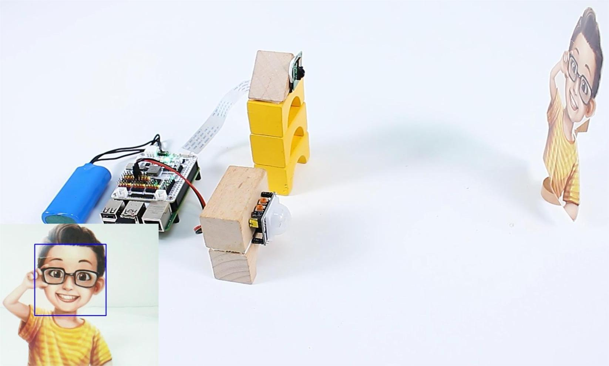

<!-- xwalk-page-header:start -->

[xWalk documentation](../../../index.md) / [8. xWalk guides](../../index.md) / C++ security-system composition

**8. xWalk guides &middot; Module 18**

<!-- xwalk-page-header:end -->

# C++ security-system composition

Use `XWalkGpio` to report PIR state or edges. Schedule camera capture and face
recognition outside the GPIO callback. Use `XWalkTextToSpeech` or
`XWalkVoiceAssistant` only from an application execution context.

## 1. Image: Security-system hardware

## 2. Image: C++ application status screen

TODO: Add a C++ application screenshot after the user interface is implemented.

The application owns camera resources, models, personal-data policy, files, and
network activity. No such operation is permitted inside an interrupt handler.

---

[Previous page](Projects.md) · [Chapter index](../../index.md) · [Next page](API%20TTS.md)
