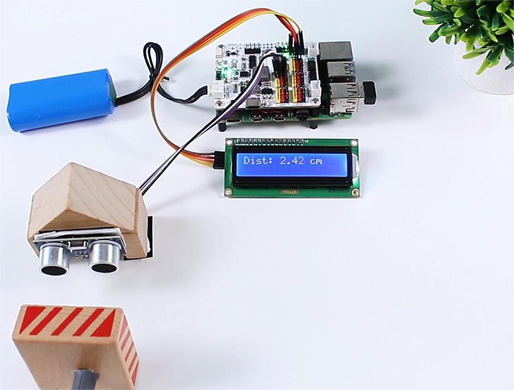

<!-- xwalk-page-header:start -->

[xWalk documentation](../../../index.md) / [8. xWalk guides](../../index.md) / Read ultrasonic distance

**8. xWalk guides &middot; Module 48**

<!-- xwalk-page-header:end -->

# Read ultrasonic distance

Create separate trigger and echo `XWalkGpio` objects and pass them to
`XWalkUltrasonic`.

## 1. Image: Ultrasonic connection

Successful results are expressed in centimetres. Do not interpret timeout as
zero distance. A moving robot should enter a safe state after repeated timeout
or invalid-pulse results. An optional display remains application-owned.

---

[Previous page](Project%20Photoresistor.md) · [Chapter index](../../index.md) · [Next page](FAQ.md)
